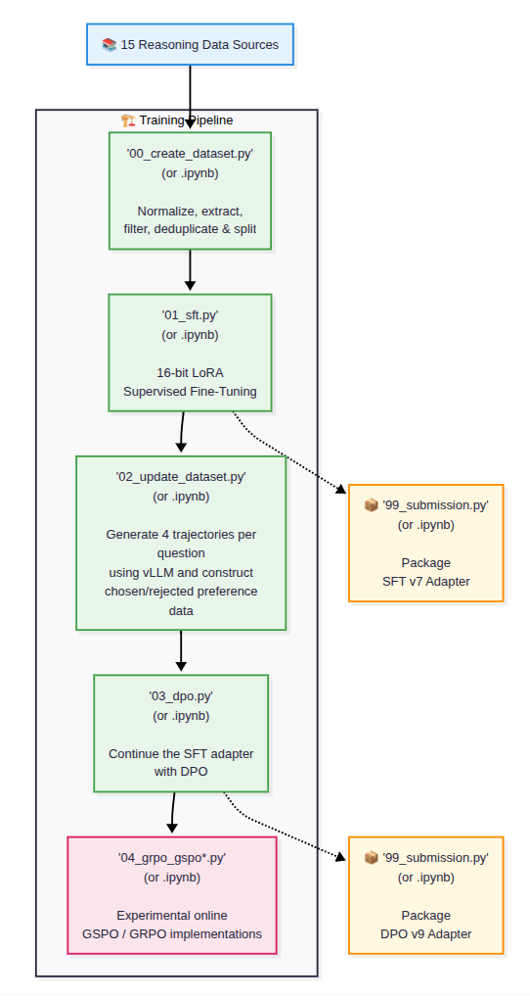

# nvidia-nemotron

Training and dataset-building pipeline for NVIDIA Nemotron reasoning experiments. The repo is organized as py:percent scripts in `src/*.py` with matching Kaggle notebooks in `notebooks/*.ipynb`; the notebooks are the GPU-server execution form of the scripts.

## Published Artifacts

**Dataset**
- Kaggle: [`rohitraje0493/nemotron-reasoning`](https://www.kaggle.com/datasets/rohitraje0493/nemotron-reasoning)
- Hugging Face: [`the-submitter/nemotron-reasoning`](https://huggingface.co/datasets/the-submitter/nemotron-reasoning)

**SFT**
- Best noted run: `v7`, public `0.836`, private `0.852`
- Kaggle: [`nemotron-3-nano/transformers/lora-sft/7`](https://www.kaggle.com/models/rohitraje0493/nemotron-3-nano/Transformers/lora-sft/7)
- Hugging Face: [`the-submitter/nemotron-lora-sft-v2`](https://huggingface.co/the-submitter/nemotron-lora-sft-v2)

**DPO**
- Best noted run: `v9`, public `0.844`, private `0.856`
- Kaggle: [`nemotron-3-nano/transformers/lora-dpo/9`](https://www.kaggle.com/models/rohitraje0493/nemotron-3-nano/transformers/lora-dpo)
- Hugging Face: [`the-submitter/nemotron-lora-dpo-v7`](https://huggingface.co/the-submitter/nemotron-lora-dpo-v7)

[**Kaggle notebooks**](#kaggle-notebook-run-notes-notebooksipynb)

[**Kaggle writeup**](https://kaggle.com/competitions/nvidia-nemotron-model-reasoning-challenge/writeups/nvidia-nemotron-model-reasoning-challenge)

## Repository Layout

| py script | corresponding notebook | description |
| --- | --- | --- |
| [`src/00_create_dataset.py`](src/00_create_dataset.py) | [`notebooks/00_create_dataset.ipynb`](notebooks/00_create_dataset.ipynb) | build the unified reasoning dataset |
| [`src/01_sft.py`](src/01_sft.py) | [`notebooks/01_sft.ipynb`](notebooks/01_sft.ipynb) | supervised fine-tuning with Unsloth + TRL `SFTTrainer` |
| [`src/02_update_dataset.py`](src/02_update_dataset.py) | [`notebooks/02_update_dataset.ipynb`](notebooks/02_update_dataset.ipynb) | generate DPO chosen/rejected samples with vLLM |
| [`src/03_dpo.py`](src/03_dpo.py) | [`notebooks/03_dpo.ipynb`](notebooks/03_dpo.ipynb) | continue the SFT LoRA adapter with DPO |
| [`src/04_grpo_gspo_unsloth.py`](src/04_grpo_gspo_unsloth.py) | [`notebooks/04_grpo_gspo_unsloth.ipynb`](notebooks/04_grpo_gspo_unsloth.ipynb) | GSPO/GRPO experiment using Unsloth + colocated vLLM |
| [`src/04_grpo_gspo_trl.py`](src/04_grpo_gspo_trl.py) | [`notebooks/04_grpo_gspo_trl.ipynb`](notebooks/04_grpo_gspo_trl.ipynb) | native Transformers/PEFT + TRL GRPO variant |
| [`src/04_grpo_gspo_nemo_rl.py`](src/04_grpo_gspo_nemo_rl.py) ([`nemo-rl`](https://github.com/the-submitter/nvidia-nemotron/tree/nemo-rl) branch) | [`notebooks/04_grpo_gspo_nemo_rl.ipynb`](notebooks/04_grpo_gspo_nemo_rl.ipynb) ([`nemo-rl`](https://github.com/the-submitter/nvidia-nemotron/tree/nemo-rl) branch) | NeMo RL GRPO variant with custom reward environment + colocated vLLM |
| [`src/99_submission.py`](src/99_submission.py) | [`notebooks/99_submission.ipynb`](notebooks/99_submission.ipynb) | Kaggle submission script |
| `references/` | `references/notebooks/` | reference notebooks/scripts used while adapting SFT, DPO, metric, and GRPO logic |

## Execution Model

The scripts are written in py:percent format so they can be edited as Python files and run as notebooks on Kaggle. Most paths default to Kaggle locations such as `/kaggle/input` and `/kaggle/working`, while key settings can be overridden with environment variables.

## Hardware and Runtime

Experiments were run on the Kaggle G4 VM server.

| Item | Value |
| --- | --- |
| OS | Ubuntu 22.04 LTS |
| CPU | AMD EPYC 9B45, 24 cores / 48 threads |
| RAM | 176 GB |
| GPU | 1 x NVIDIA RTX PRO 6000 Blackwell, 96 GB |
| Internet | Disabled |

| No. | Step | Notebook(s) | Runtime |
| --- | --- | --- | ---: |
| 00 | Create Dataset | [`notebooks/00_create_dataset.ipynb`](notebooks/00_create_dataset.ipynb) | About 33 minutes |
| 01 | SFT | [`notebooks/01_sft.ipynb`](notebooks/01_sft.ipynb) | About 7 hours |
| 02 | Update Dataset | [`notebooks/02_update_dataset.ipynb`](notebooks/02_update_dataset.ipynb) | About 4 hours, 30 minutes |
| 03 | DPO | [`notebooks/03_dpo.ipynb`](notebooks/03_dpo.ipynb) | About 45 minutes |
| 04 | GSPO/GRPO | `notebooks/04_grpo_gspo*.ipynb` | state-dict sync issues, CUDA OOM |

## Installation

- `torch==2.10.0+cu128` is assumed to be already installed on the system. This is the default on Kaggle G4 VM servers. If not installed, do so using: 
  ```bash
  pip install "torch==2.10.0" torchvision --index-url https://download.pytorch.org/whl/cu128
  ```
- The notebook scripts in `notebooks/*.ipynb` install their own requirements besides `torch`, so skip the manual installation given below.
- To use the corresponding python (py:percent) scripts in `src/*.py`, install dependencies using:
  ```bash
  # pip
  pip install -r requirements.txt

  # OR uv
  uv pip install -r requirements.txt
  ```
  Notes: 
  - create a python (or uv) venv `python -m venv .venv` (or `uv venv`) if needed. 
  - The `src/04_grpo_gspo_nemo_rl.py` script in `nemo-rl` branch installs its own dependencies besides `torch`, so this manual install step can be skipped for it.

## Pipeline Overview



1. `00_create_dataset.py` (or `00_create_dataset.ipynb`) creates and uploads the base reasoning dataset.
2. `01_sft.py`( or `01_sft.ipynb`) filters response-ready samples and trains an SFT LoRA adapter.
3. `02_update_dataset.py` (or `02_update_dataset.ipynb`) uses the base model + LoRA in vLLM to generate multiple trajectories for response-missing prompts, then writes `chosen` / `rejected` preference fields.
4. `03_dpo.py` (or `03_dpo.ipynb`) filters preference-ready rows and continues the LoRA adapter with DPO.
5. `04_grpo_gspo*.py` (or `04_grpo_gspo*.ipynb`) run experimental GSPO/GRPO training from the SFT/DPO adapter or a new adapter.

## [`src/00_create_dataset.py`](src/00_create_dataset.py) — Dataset Creation

**Corresponding Notebook**: [`notebooks/00_create_dataset.ipynb`](notebooks/00_create_dataset.ipynb)

Builds the unified dataset schema:

- `id`
- `source`
- `domain`
- `prompt`
- `reasoning`
- `response`
- `final_answer`
- `answer_type`
- `difficulty`

**Sources**
- Local/Kaggle inputs: NVIDIA Nemotron model reasoning challenge data and Nemotron COT Tong.
- Hugging Face datasets: OpenMathReasoning, Enigmata, NuminaMath, competition_math, OpenR1-Math, GSM8K, DROP, ProofWriter, ZebraLogic, FOLIO, ProntoQA, SVAMP, ASDiv.

**Processing**
- Normalizes each source into the shared schema via `DatasetConfig`.
- Extracts `<think>...</think>` reasoning and response content where available.
- Reconciles `final_answer` from boxed answers when a response is present.
- Supports streaming materialization for large datasets such as `nvidia/OpenMathReasoning`.
- Applies optional source-level filters, length ranking, per-dataset dedupe, fixed split allocation, global split dedupe, high-quality filtering, and split shuffling.

**Dedupe**
- Per-dataset dedupe: `DatasetConfig(dedupe=True)` by default.
- Global split dedupe: enabled by default through `TRAIN_GLOBAL_DEDUPE`, `VALIDATION_GLOBAL_DEDUPE`, `TEST_GLOBAL_DEDUPE`.
- Dedupe keeps one row per prompt, preferring rows with a non-empty `response`, then shorter `response + reasoning`.

**Outputs**
- Saves a local Hugging Face `DatasetDict` under `LOCAL_OUTPUT_DIR`.
- Optionally pushes to Hugging Face and Kaggle.

Important knobs:

- `UPLOAD_TO_HF`, `UPLOAD_TO_KAGGLE`
- `TRAIN_FILTER_HQ`, `VALIDATION_FILTER_HQ`, `TEST_FILTER_HQ`
- `TRAIN_GLOBAL_DEDUPE`, `VALIDATION_GLOBAL_DEDUPE`, `TEST_GLOBAL_DEDUPE`
- `TRAIN_SHUFFLE`, `VALIDATION_SHUFFLE`, `TEST_SHUFFLE`
- `KEEP_IN_MEMORY`, `DATASET_NUM_PROC`, `STREAM_LOG_INTERVAL`

| Split | Records |
|---|---:|
| Train | **80,611** |
| Validation | **514** |
| Test | **473** |
| **Total** | **81,598** |

## [`src/01_sft.py`](src/01_sft.py) — SFT Training

**Corresponding Notebook**: [`notebooks/01_sft.ipynb`](notebooks/01_sft.ipynb)

Trains Nemotron with response-ready rows from the reasoning dataset.

**Dataset flow**
- Loads the dataset from disk, Kaggle, or Hugging Face.
- Filters rows with non-empty `prompt` and non-empty `response`.
- Supports source include/order/exclude rules.
- Supports stable source ordering with `TRAIN_ORDER_REMAINING` / `EVAL_ORDER_REMAINING`.
- Applies optional high-quality filtering via `TRAIN_FILTER_HQ` / `EVAL_FILTER_HQ`.
- Applies optional index ranges and shuffling.
- Converts examples into chat-style conversations with a user prompt and assistant response.

**Training**
- Uses Unsloth `FastLanguageModel` and TRL `SFTTrainer`.
- Creates or resumes a LoRA adapter.
- Uses `train_on_responses_only()` with configurable instruction/response delimiters.
- Saves the adapter and tokenizer to `ADAPTER_OUTPUT_DIR`.
- Optionally uploads adapter artifacts to Hugging Face and Kaggle.

Important knobs:

- `MODEL_PATH`, `DATASET_PATH`, `ADAPTER_INPUT_PATH`
- `TRAIN_INCLUDE_SOURCES`, `TRAIN_ORDER_BY_SOURCES`, `TRAIN_EXCLUDE_SOURCES`
- `TRAIN_MIN_IDX`, `TRAIN_MAX_IDX`, `EVAL_MIN_IDX`, `EVAL_MAX_IDX`
- `LORA_R`, `LORA_ALPHA`, `MAX_SEQ_LENGTH`
- `PER_DEVICE_TRAIN_BATCH_SIZE`, `GRADIENT_ACCUMULATION_STEPS`
- `LEARNING_RATE`, `NUM_TRAIN_EPOCHS`, `MAX_STEPS`
- `PUSH_TO_HUB`, `PUSH_TO_KAGGLE`

## [`src/02_update_dataset.py`](src/02_update_dataset.py) — Preference Dataset Update

**Corresponding Notebook**: [`notebooks/02_update_dataset.ipynb`](notebooks/02_update_dataset.ipynb)

Adds DPO preference fields to the base dataset by generating new trajectories for candidate prompts.

**Candidate selection**
- Loads the reasoning dataset and ensures preference columns exist.
- Selects rows where DPO processing is still pending.
- Prioritizes response-missing rows, then a configurable amount/range of existing-response rows.
- Supports source ordering and optional remaining-source pass-through with `*_ORDER_REMAINING`.
- Supports candidate-level high-quality filtering for missing and existing groups.
- Marks selected candidates with `dpo_selected` and updates `dpo_processed` incrementally.

**Generation**
- Builds vLLM offline inference with the base Nemotron model and optional LoRA adapter.
- Runs `TRAJECTORIES` generations per prompt in batches of `PROMPT_BATCH_SIZE`.
- Formats prompts through the tokenizer chat template.
- Supports debug CSV backups for generated trajectories and selected preferences.

**Preference selection**
- Extracts final answers with both competition-metric boxed extraction and balanced-brace boxed extraction.
- Falls back to textual/number answer extraction when boxed answers are absent.
- Verifies generated answers using numeric closeness, `math_verify`, and normalized string comparison.
- For missing-response rows, chooses the first shortest correct output as `chosen` and first shortest wrong output as `rejected`.
- For existing-response rows, can reuse or replace fields according to the candidate’s generated correctness.
- Populates `reasoning` and `response` from the selected `chosen` completion for previously empty rows.

**Outputs**
- Writes incremental split snapshots under `INCREMENTAL_DIR`.
- Saves the updated dataset locally.
- Optionally uploads to Hugging Face and Kaggle.

Important knobs:

- `MODEL_PATH`, `LORA_PATH`, `DATASET_PATH`
- `TRAJECTORIES`, `PROMPT_BATCH_SIZE`
- `TRAIN_MISSING_TAKE`, `TRAIN_EXISTING_TAKE`
- `*_MISSING_MIN_IDX`, `*_MISSING_MAX_IDX`, `*_EXISTING_MIN_IDX`, `*_EXISTING_MAX_IDX`
- `*_MISSING_FILTER_HQ`, `*_EXISTING_FILTER_HQ`
- `TRAIN_ORDER_REMAINING`, `VALIDATION_ORDER_REMAINING`, `TEST_ORDER_REMAINING`
- `DEBUG_CSV_BACKUP`, `BACKUP_TRAJECTORIES`
- `UPLOAD_TO_HF`, `UPLOAD_TO_KAGGLE`

## [`src/03_dpo.py`](src/03_dpo.py) — DPO Training

**Corresponding Notebook**: [`notebooks/03_dpo.ipynb`](notebooks/03_dpo.ipynb)

Continues the SFT LoRA adapter with direct preference optimization.

**Dataset flow**
- Loads the updated reasoning dataset.
- Filters rows with non-empty `chosen` and `rejected`.
- Supports source include/order/exclude rules and `TRAIN_ORDER_REMAINING` / `EVAL_ORDER_REMAINING`.
- Applies optional high-quality filtering, index ranges, and shuffling.
- Renders DPO examples with `prompt`, `chosen`, and `rejected` text using the same prompt formatting style as SFT.

**Training**
- Uses Unsloth patching and TRL `DPOTrainer`.
- Loads an existing LoRA adapter from `ADAPTER_INPUT_PATH`.
- Saves the continued adapter to `ADAPTER_OUTPUT_DIR`.
- Optionally uploads to Hugging Face and Kaggle.

Important knobs:

- `MODEL_PATH`, `ADAPTER_INPUT_PATH`, `DATASET_PATH`
- `DPO_BETA`, `DPO_LOSS_TYPE`, `PRECOMPUTE_REF_LOG_PROBS`
- `TRAIN_INCLUDE_SOURCES`, `TRAIN_ORDER_BY_SOURCES`, `TRAIN_EXCLUDE_SOURCES`
- `TRAIN_FILTER_HQ`, `EVAL_FILTER_HQ`
- `TRAIN_MIN_IDX`, `TRAIN_MAX_IDX`, `EVAL_MIN_IDX`, `EVAL_MAX_IDX`
- `LORA_R`, `LORA_ALPHA`, `LEARNING_RATE`, `MAX_STEPS`

## [`src/04_grpo_gspo_unsloth.py`](src/04_grpo_gspo_unsloth.py) — GSPO/GRPO with Unsloth

**Corresponding Notebook**: [`notebooks/04_grpo_gspo_unsloth.ipynb`](notebooks/04_grpo_gspo_unsloth.ipynb)

Experimental GSPO/GRPO stage using TRL `GRPOTrainer` with colocated vLLM and Unsloth model loading.

**Dataset flow**
- Loads the reasoning dataset.
- Filters rows with non-empty `prompt` and `final_answer`.
- Supports all source controls used in SFT/DPO.
- Adds `TRAIN_DPO_AWARE` / `EVAL_DPO_AWARE` ordering that prioritizes examples with useful DPO metadata.
- Adds `TRAIN_DPO_SORT_REMAINING` / `EVAL_DPO_SORT_REMAINING` so remaining-source rows preserve the original source mix while swapping indices within each source by DPO priority.

**Reward**
- Unified reward combines:
  - exact answer verification against `final_answer` using a combination of binary full match, `math.isclose()` with relative tolerance of 1e-2, and `math_verify`.
  - fuzzy matching of extracted answers
  - fuzzy matching (token set ratio) of full completion against known `reasoning + response`
  - boxed-answer format reward
  - non-empty `<think>...</think>` reward
- Answer extraction uses competition boxed extraction, balanced-brace boxed extraction, and fallback extraction.
- Handles completions that contain `</think>` without a leading `<think>` by prepending the expected opening tag.
- Sets `importance_sampling_level="sequence"` to enable GSPO-style sequence-level importance sampling.

**Status**
- Kept as an experimental Unsloth path.
- Notes from Kaggle: vLLM/Unsloth state-dict synchronization issues were encountered with the current Nemotron hybrid model.

## [`src/04_grpo_gspo_trl.py`](src/04_grpo_gspo_trl.py) — GSPO/GRPO with Native TRL

**Corresponding Notebook**: [`notebooks/04_grpo_gspo_trl.ipynb`](notebooks/04_grpo_gspo_trl.ipynb)

Native Transformers/PEFT + TRL GRPO variant created because Unsloth had issues syncing with vLLM for this hybrid model.

**Differences from [`04_grpo_gspo_unsloth.py`](src/04_grpo_gspo_unsloth.py)**
- Loads the base model with `AutoModelForCausalLM`.
- Attaches or resumes LoRA with PEFT.
- Uses TRL `GRPOTrainer` directly with `use_vllm=True` and `vllm_mode="colocate"`.
- Keeps the same dataset preparation, source ordering, DPO-aware ordering, reward function, and upload flow as the Unsloth GRPO script.

**Status**
- Notes from Kaggle: native TRL colocated vLLM path hit CUDA OOM in the recorded run.

## [`src/04_grpo_gspo_nemo_rl.py`](src/04_grpo_gspo_nemo_rl.py) — GSPO/GRPO with NeMo RL

**Corresponding Notebook**: [`notebooks/04_grpo_gspo_nemo_rl.ipynb`](notebooks/04_grpo_gspo_nemo_rl.ipynb)

**GitHub branch**: [`nemo-rl`](https://github.com/the-submitter/nvidia-nemotron/tree/nemo-rl)

- Available on the [`nemo-rl`](https://github.com/the-submitter/nvidia-nemotron/tree/nemo-rl) branch. 
- This experimental Kaggle path runs NeMo-RL's `examples/run_grpo.py` entry point with 
a materialized GRPO/GSPO configuration, colocated vLLM generation, and a 
registered custom reward environment. 
- It keeps the same response-ready dataset preparation, source/HQ/DPO-aware ordering, 
and unified answer/format/reasoning reward used by the other GRPO notebooks.

- The notebook is designed for an internet-disabled Kaggle GPU session: it builds
a writable offline virtual environment from the attached dependency dataset,
reuses Kaggle's CUDA-matched PyTorch installation, and makes Ray workers use the
same environment.
- `configs/` contain the NeMo RL configs for GSPO/GRPO.
- `src/nemo_bridge/` contains utility code for the custom NeMo RL environment and connecting to NeMo RL.

**Status**
- Installation and runtime compatibility on the Kaggle G4 VM server 
remain the principal area of experimentation for this path.


## High-Quality Filtering

Several scripts share a high-quality filter. A row is retained if:

- `source` is one of `nvidia-nemotron-model-reasoning-challenge` or `dgxchen/nemotron-cot-tong`; or
- `answer_type` is one of `integer`, `float`, `fraction`.

This is controlled by split-specific env vars such as `TRAIN_FILTER_HQ`, `EVAL_FILTER_HQ`, and the create/update dataset variants.

## Source Ordering Controls

Training and update scripts support source controls:

- `*_INCLUDE_SOURCES`: required sources to place first.
- `*_ORDER_BY_SOURCES`: explicit source order; `*` marks where remaining sources are placed.
- `*_EXCLUDE_SOURCES`: sources to remove.
- `*_ORDER_REMAINING`: when false, remaining-source rows keep stable original dataset source-mix order instead of being grouped by source.

GRPO scripts also support:

- `*_DPO_AWARE`: prioritize samples by available preference metadata.
- `*_DPO_SORT_REMAINING`: with `*_ORDER_REMAINING=0`, preserve remaining-source mix while sorting rows within each remaining source by DPO priority.

## Kaggle Notebook Run Notes (`notebooks/*.ipynb`)

| Notebook | Step | Status | Kaggle Link |
| --- | --- | --- | --- |
| [`00_create_dataset.ipynb`](notebooks/00_create_dataset.ipynb) | Create Dataset | Version 19 | [nvidia-nemotron-create-dataset](https://www.kaggle.com/code/rohitraje0493/nvidia-nemotron-create-dataset) |
| [`01_sft.ipynb`](notebooks/01_sft.ipynb) | SFT Train | Version 11 | [nvidia-nemotron-sft](https://www.kaggle.com/code/rohitraje0493/nvidia-nemotron-sft) |
| [`02_update_dataset.ipynb`](notebooks/02_update_dataset.ipynb) | Update Dataset | Version 12 | [nvidia-nemotron-update-dataset](https://www.kaggle.com/code/rohitraje0493/nvidia-nemotron-update-dataset) |
| [`03_dpo.ipynb`](notebooks/03_dpo.ipynb) | DPO Train | Version 11 | [nvidia-nemotron-dpo](https://www.kaggle.com/code/rohitraje0493/nvidia-nemotron-dpo) |
| [`04_grpo_gspo_unsloth.ipynb`](notebooks/04_grpo_gspo_unsloth.ipynb) | GSPO Train Unsloth | vLLM path hit Unsloth state-dict mapping/sync issues; Transformers fallback was too slow | [nvidia-nemotron-grpo-gspo-unsloth](https://www.kaggle.com/code/rohitraje0493/nvidia-nemotron-grpo-gspo-unsloth?scriptVersionId=329178155) |
| [`04_grpo_gspo_trl.ipynb`](notebooks/04_grpo_gspo_trl.ipynb) | GSPO Train TRL | colocated vLLM path hit CUDA OOM | [nvidia-nemotron-grpo-gspo-trl](https://www.kaggle.com/code/rohitraje0493/nvidia-nemotron-grpo-gspo-trl) |
| [`04_grpo_gspo_nemo_rl.ipynb`](notebooks/04_grpo_gspo_nemo_rl.ipynb) | GSPO Train NeMo RL | installation and runtime compatibility issues/debugging on Kaggle G4 VM GPU server (internet disabled) | [nvidia-nemotron-grpo-gspo-nemo-rl](https://www.kaggle.com/code/rohitraje0493/nvidia-nemotron-grpo-gspo-nemo-rl) |
| [`99_submission.ipynb`](notebooks/99_submission.ipynb) | Kaggle Submission | Version 20 | [nvidia-nemotron-submission](https://www.kaggle.com/code/rohitraje0493/nvidia-nemotron-submission) |

## Practical Notes

- Most scripts default uploads off except dataset creation; check `UPLOAD_TO_HF`, `UPLOAD_TO_KAGGLE`, `PUSH_TO_HUB`, and `PUSH_TO_KAGGLE` before running.
- Kaggle secrets are stubbed in the committed scripts; set credentials through environment variables or restore Kaggle secret loading in private runs.
- `KEEP_IN_MEMORY=1` is used heavily to avoid local disk pressure on Kaggle.
- The dataset/update pipeline intentionally writes incremental artifacts so interrupted generation runs can be resumed without losing previous DPO updates.
