# NVIDIA Nemotron Model Reasoning Challenge
## Winning Solution Documentation
### Open Contribution Award — Best RL Method

---

## A1. Acknowledgements

I would like to thank NVIDIA and Kaggle for organizing an excellent competition that provided an opportunity to explore reasoning-model post-training under realistic resource constraints. This work was made possible by the open-source ecosystem, particularly the communities behind Hugging Face, TRL, PEFT, Unsloth, vLLM, NVIDIA NeMo RL, Weights & Biases, and the many public reasoning datasets used throughout this project. I hope this writeup helps others reproduce, build upon, and extend the ideas presented here.

---

## A2. Competition and Team Details

| Field | Details |
|---|---|
| **Competition Name** | NVIDIA Nemotron Model Reasoning Challenge |
| **Award** | Open Contribution Award — **Best RL Method** |
| **Team Name** | **The Submitter** |
| **Team Size** | One |
| **Public Leaderboard Score** | **0.844** |
| **Private Leaderboard Score** | **0.856** |
| **Private Leaderboard Place** | **347th of 4,182 teams** — Bronze medal |
| **Final Submitted Checkpoint** | DPO LoRA adapter, repository model version `lora-dpo/9` |
| **Base Model** | `nvidia/NVIDIA-Nemotron-3-Nano-30B-A3B-BF16` |

---

## A3. Summary

The solution used a staged reasoning-alignment pipeline rather than a single training run. Fifteen mathematical, logical, proof, puzzle, and question-answering sources were normalized into a common schema, filtered, deduplicated, and used to train a 16-bit LoRA adapter with supervised fine-tuning. The SFT policy then generated four candidate reasoning trajectories for each of 2,169 selected questions, and a robust verifier converted the outputs into chosen and rejected preference examples. DPO continued the same SFT adapter and improved the public leaderboard score from **0.836 to 0.844** and the private score from **0.852 to 0.856**. The repository also implements GSPO/GRPO with Unsloth/TRL, native Transformers/PEFT/TRL, and NVIDIA NeMo RL, sharing a correctness-dominant reward function; those online-RL paths remained experimental because of state-dictionary synchronization, runtime, dependency, and GPU-memory constraints.

### Pipeline overview


1. `00_create_dataset.py` (or `00_create_dataset.ipynb`) creates and uploads the base reasoning dataset.
2. `01_sft.py`( or `01_sft.ipynb`) filters response-ready samples and trains an SFT LoRA adapter.
3. `02_update_dataset.py` (or `02_update_dataset.ipynb`) uses the base model + LoRA in vLLM to generate multiple trajectories for response-missing prompts, then writes `chosen` / `rejected` preference fields.
4. `03_dpo.py` (or `03_dpo.ipynb`) filters preference-ready rows and continues the LoRA adapter with DPO.
5. `04_grpo_gspo*.py` (or `04_grpo_gspo*.ipynb`) run experimental GSPO/GRPO training from the SFT/DPO adapter or a new adapter.

### Reproducibility entry points

| Stage | Python script | Notebook |
|---|---|---|
| Dataset creation | [`src/00_create_dataset.py`](https://github.com/the-submitter/nvidia-nemotron/blob/main/src/00_create_dataset.py) | [`notebooks/00_create_dataset.ipynb`](https://github.com/the-submitter/nvidia-nemotron/blob/main/notebooks/00_create_dataset.ipynb) |
| Supervised fine-tuning | [`src/01_sft.py`](https://github.com/the-submitter/nvidia-nemotron/blob/main/src/01_sft.py) | [`notebooks/01_sft.ipynb`](https://www.kaggle.com/code/rohitraje0493/nvidia-nemotron-create-dataset) |
| Preference generation | [`src/02_update_dataset.py`](https://github.com/the-submitter/nvidia-nemotron/blob/main/src/02_update_dataset.py) | [`notebooks/02_update_dataset.ipynb`](https://github.com/the-submitter/nvidia-nemotron/blob/main/notebooks/02_update_dataset.ipynb) |
| Direct Preference Optimization | [`src/03_dpo.py`](https://github.com/the-submitter/nvidia-nemotron/blob/main/src/03_dpo.py) | [`notebooks/03_dpo.ipynb`](https://github.com/the-submitter/nvidia-nemotron/blob/main/notebooks/03_dpo.ipynb) |
| Unsloth GSPO/GRPO | [`src/04_grpo_gspo_unsloth.py`](https://github.com/the-submitter/nvidia-nemotron/blob/main/src/04_grpo_gspo_unsloth.py) | [`notebooks/04_grpo_gspo_unsloth.ipynb`](https://github.com/the-submitter/nvidia-nemotron/blob/main/notebooks/04_grpo_gspo_unsloth.ipynb) |
| Native TRL GSPO/GRPO | [`src/04_grpo_gspo_trl.py`](https://github.com/the-submitter/nvidia-nemotron/blob/main/src/04_grpo_gspo_trl.py) | [`notebooks/04_grpo_gspo_trl.ipynb`](https://github.com/the-submitter/nvidia-nemotron/blob/main/notebooks/04_grpo_gspo_trl.ipynb) |
| NeMo RL GSPO/GRPO | [`src/04_grpo_gspo_nemo_rl.py`](https://github.com/the-submitter/nvidia-nemotron/blob/nemo-rl/src/04_grpo_gspo_nemo_rl.py) on [`nemo-rl`](https://github.com/the-submitter/nvidia-nemotron/tree/nemo-rl) branch | [`notebooks/04_grpo_gspo_nemo_rl.ipynb`](https://github.com/the-submitter/nvidia-nemotron/blob/nemo-rl/notebooks/04_grpo_gspo_nemo_rl.ipynb) on [`nemo-rl`](https://github.com/the-submitter/nvidia-nemotron/tree/nemo-rl) branch |
| Submission packaging | [`src/99_submission.py`](https://github.com/the-submitter/nvidia-nemotron/blob/main/src/99_submission.py) | [`notebooks/99_submission.ipynb`](https://github.com/the-submitter/nvidia-nemotron/blob/main/notebooks/99_submission.ipynb) |

**GitHub repo**: https://github.com/the-submitter/nvidia-nemotron/tree/main

---

## A4. Feature Selection and Engineering

### Interpreting “features” for a reasoning language model

Traditional variable-importance and partial-dependence plots are not directly applicable because this solution did not use fixed tabular features. The model consumes tokenized prompts and completions. Its effective features are the correctness, structure, provenance, formatting, and quality signals contained in the training examples.

Feature importance was therefore assessed through:

- source selection and quotas;
- high-quality filtering;
- response availability;
- correctness-verifier outcomes;
- preference-pair eligibility;
- stage-level leaderboard comparisons;
- DPO chosen-versus-rejected diagnostics.

### Most important training signals

| Priority | Training signal | Why it mattered |
|---:|---|---|
| 1 | **Verified final-answer correctness** | Determined whether a generated trajectory could serve as a preferred response |
| 2 | **Complete chosen/rejected pair** | Supplied the direct pairwise supervision required by DPO |
| 3 | **High-quality reasoning plus final response** | Avoided training primarily on incomplete or response-only records |
| 4 | **Competition-aligned and Nemotron-oriented sources** | Reduced distribution mismatch with the evaluation tasks |
| 5 | **Robust `\boxed{...}` extraction** | Prevented correct LaTeX answers from being mislabeled |
| 6 | **Numeric and symbolic verification** | Reduced false negatives caused by representational differences |
| 7 | **Nemotron-compatible `<think>` formatting** | Preserved consistent chat-template behavior across stages |
| 8 | **Answer type** | Helped prioritize reliably verifiable integers, floats, fractions, and expressions |
| 9 | **Source-aware filtering and ordering** | Preserved useful source diversity while emphasizing higher-value records |
| 10 | **Completion length** | Supported concise duplicate resolution and reduced DPO length bias |

### Important transformations

#### 1. Canonical schema

All source datasets were transformed into a common schema:

```text
id
source
domain
prompt
reasoning
response
final_answer
answer_type
difficulty
```

The preference-generation stage later added:

```text
chosen
rejected
dpo_row_index
dpo_selected
dpo_processed
```

#### 2. Canonical reasoning and response format

Examples were normalized toward the following structure:

```text
<think>
Reasoning steps
</think>

Final response containing \boxed{answer}
```

This mattered because the Nemotron chat template may already insert reasoning tags. The DPO renderer removes redundant leading `<think>` tags and normalizes the chosen and rejected completions before training.

#### 3. Robust answer extraction

The verifier combined several methods rather than relying on one regular expression:

- competition-style boxed-answer extraction;
- balanced-brace parsing for nested `\boxed{...}` expressions;
- fallback extraction of textual or numeric answers;
- normalized string comparison;
- numeric closeness checks;
- mathematical or symbolic verification through `math_verify` when supported.

This handled answers such as:

```text
\boxed{\frac{3}{7}}
\boxed{\text{True}}
\boxed{x^{2}+2x+1}
```

#### 4. Preference labels generated from the policy itself

For each selected question, the SFT policy generated four candidate trajectories. The shortest verified-correct output became `chosen`, and the shortest verified-incorrect output became `rejected` when both types were available.

Using candidates from the same policy kept style, fluency, and vocabulary similar across preferred and rejected responses. DPO therefore had to focus more strongly on reasoning outcome rather than obvious superficial differences.

#### 5. Response-aware deduplication

When duplicate prompts existed, records with a usable response were preferred. When more than one response-bearing duplicate remained, the shorter combined reasoning and response was retained. This favored complete, concise examples over unnecessarily verbose duplicates.

---

## A5. Training Methods

## A5.1 Dataset Creation

`src/00_create_dataset.py` consolidated 15 sources:

1. NVIDIA Nemotron Model Reasoning Challenge data
2. `dgxchen/nemotron-cot-tong`
3. `nvidia/OpenMathReasoning`
4. `BytedTsinghua-SIA/Enigmata-Eval`
5. `AI-MO/NuminaMath-1.5`
6. `qwedsacf/competition_math`
7. `open-r1/OpenR1-Math-220k`
8. `openai/gsm8k`
9. `EleutherAI/drop`
10. `tasksource/proofwriter`
11. `WildEval/ZebraLogic`
12. `yale-nlp/FOLIO`
13. `renma/ProntoQA`
14. `ChilleD/SVAMP`
15. `EleutherAI/asdiv`

These sources provided a heterogeneous mixture of:

- arithmetic and mathematical word problems;
- competition mathematics;
- formal and informal proofs;
- first-order logic;
- deductive reasoning;
- reading comprehension;
- constraint-satisfaction puzzles;
- symbolic and numeric answers;
- short and long reasoning traces.

### Dataset-processing operations

Each source had a source-specific adapter mapping its original fields into the canonical schema. The combined pipeline applied:

- `<think>...</think>` reasoning extraction;
- response and final-answer extraction;
- boxed-answer reconciliation;
- answer-type classification;
- difficulty normalization;
- source-specific quality checks;
- source-level filtering and quotas;
- response-aware duplicate removal;
- global split-level deduplication;
- deterministic shuffling;
- optional streaming materialization for large sources.

### Current dataset artifact

The current downstream dataset used by the latest notebooks contains:

| Split | Records |
|---|---:|
| Train | **80,611** |
| Validation | **514** |
| Test | **473** |
| **Total** | **81,598** |

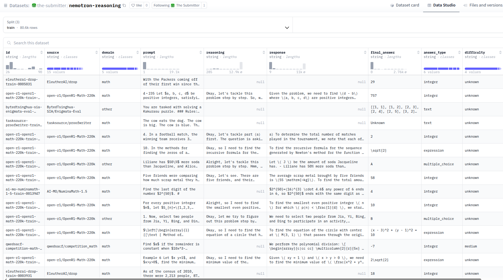

The screenshot shows the normalized fields and the approximately 80.6K-row train split after dataset creation.

---

## A5.2 Base Model and Parameter-Efficient Adaptation

The base model was:

```text
nvidia/NVIDIA-Nemotron-3-Nano-30B-A3B-BF16
```

This is a large Mixture-of-Experts reasoning model. Full-parameter fine-tuning was not practical on the available single-GPU environment, so the solution used LoRA.

The same adapter was trained sequentially:

```text
Base Nemotron model
        ↓
SFT LoRA adapter
        ↓
Continued DPO LoRA adapter
```

No model ensemble was used. The final checkpoint was one base model plus one LoRA adapter that had first learned from supervised examples and was then refined through preference optimization.

---

## A5.3 Supervised Fine-Tuning

SFT used:

- Unsloth `FastLanguageModel`;
- TRL `SFTTrainer`;
- 16-bit LoRA rather than 4-bit or 8-bit quantized LoRA;
- response-only loss masking;
- an 8,192-token maximum sequence length;
- BF16 computation;
- gradient checkpointing;
- cosine learning-rate scheduling;
- 8-bit AdamW optimization.

### Main SFT configuration

| Parameter | Value |
|---|---:|
| LoRA rank | 32 |
| LoRA alpha | 32 |
| LoRA dropout | 0 |
| Maximum sequence length | 8,192 |
| Per-device training batch size | 2 |
| Gradient accumulation | 16 |
| Epochs | 1 |
| Learning rate | `2e-4` |
| Warm-up ratio | 0.03 |
| Optimizer | 8-bit AdamW |
| Precision | BF16 |
| Scheduler | Cosine |
| Seed | 3407 |

LoRA was applied across attention, feed-forward, and projection modules, including:

```text
q_proj, k_proj, v_proj, o_proj
gate_proj, up_proj, down_proj
in_proj, out_proj
```

The SFT prompt appended an instruction requiring the final answer inside `\boxed{}`. Only assistant-response tokens contributed to the supervised loss.

### Latest SFT notebook run

The latest notebook run:

- started from 80,611 training rows;
- found 46,516 response-ready examples before the high-quality filter;
- retained 13,213 high-quality training examples;
- retained 48 validation examples;
- completed **413 optimization steps** over one epoch;
- took approximately **6 hours 54 minutes** of trainer time;
- operated close to the available 96 GB GPU-memory limit.

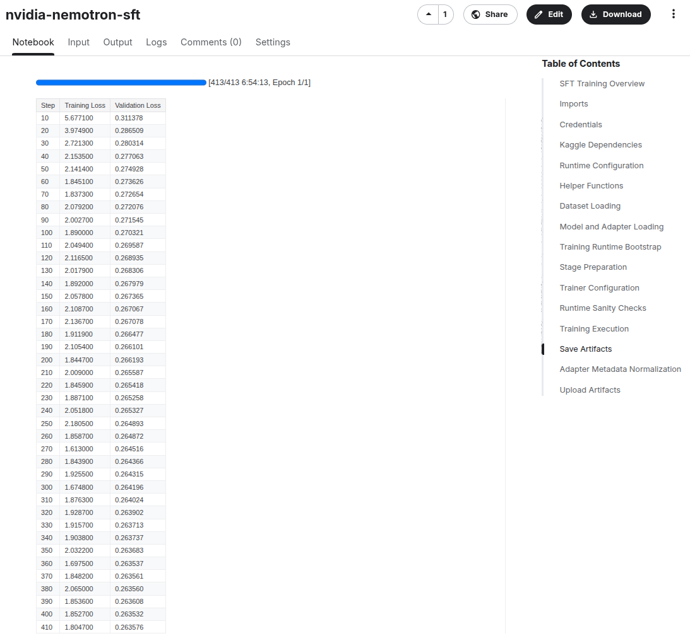

### SFT training diagnostics

<table>
<tr>
<td>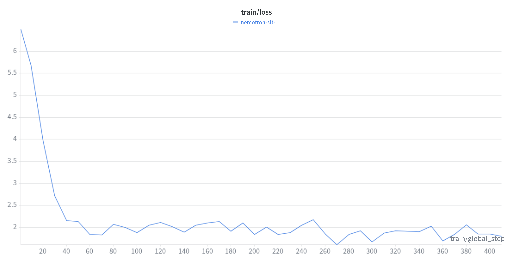</td>
<td>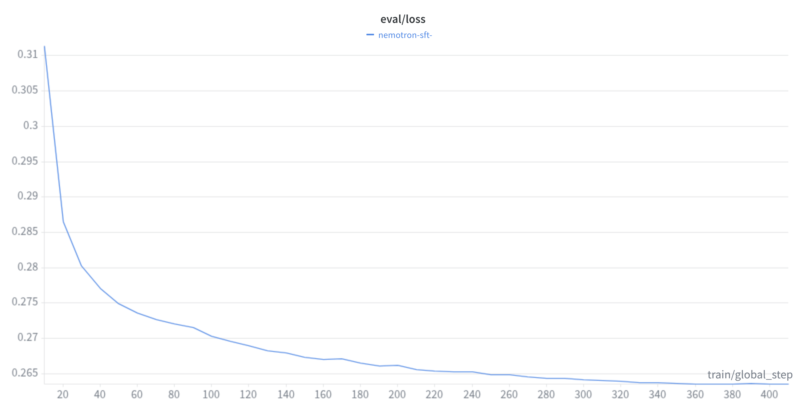</td>
</tr>
<tr>
<td align="center"><em>SFT training loss</em></td>
<td align="center"><em>SFT evaluation loss</em></td>
</tr>
</table>

The evaluation loss declined from roughly 0.31 early in training to approximately 0.264 near the end. The training loss remained noisier because the selected examples covered heterogeneous domains and completion lengths.

<table>
<tr>
<td>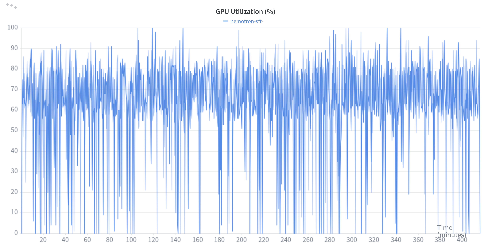</td>
<td>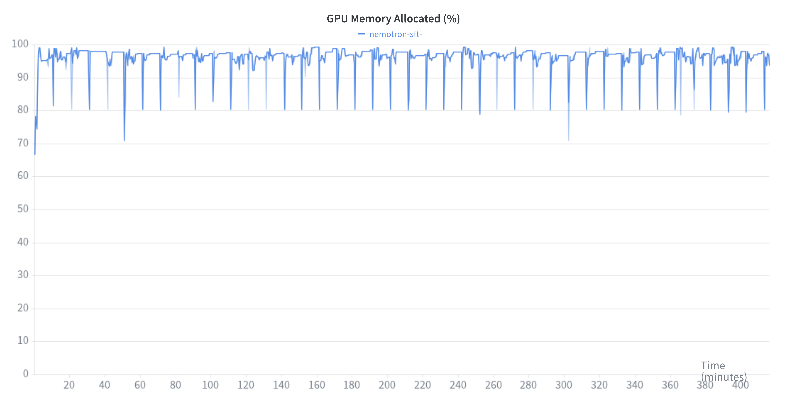</td>
</tr>
<tr>
<td align="center"><em>SFT GPU utilization</em></td>
<td align="center"><em>SFT GPU memory allocation</em></td>
</tr>
</table>

The best recorded SFT checkpoint was version 7:

| Checkpoint | Public score | Private score |
|---|---:|---:|
| SFT v7 | **0.836** | **0.852** |

---

## A5.4 Preference-Dataset Generation

`src/02_update_dataset.py` loaded the frozen base model together with the SFT LoRA adapter and used vLLM for offline generation.

### Generation configuration

| Parameter | Value |
|---|---:|
| Questions processed | **2,169** |
| Trajectories per question | **4** |
| Total generated trajectories | **8,676** |
| Prompt batch size | 100 |
| Maximum generated tokens | 7,680 |
| Maximum model length | 8,192 |
| Temperature | 1.0 |
| Top-p | 1.0 |
| Maximum concurrent sequences | 64 |
| GPU-memory utilization target | 0.95 |
| Maximum LoRA rank | 32 |
| Prefix caching | Enabled |

The relatively high temperature and four trajectories per question were intended to produce useful variation rather than four nearly identical deterministic responses.

### Verification process

A generated trajectory was treated as correct when at least one verification path succeeded:

1. normalized exact-string equality;
2. numeric equality within configured relative and absolute tolerances;
3. mathematical or symbolic equivalence using `math_verify`;
4. compatible boxed-answer extraction.

The update process was incremental and resumable. After each generation batch, the script persisted updated split snapshots so that an interrupted Kaggle run could resume without discarding completed work.

### Question-level preference outcomes

The following counts classify each processed question by whether its four generated trajectories produced usable preferred and/or rejected candidates. They are **question-level outcomes**, not counts of individual trajectories.

| Split | Chosen and Rejected | Chosen Only | Rejected Only | Questions Processed | Trajectories Generated |
|---|---:|---:|---:|---:|---:|
| Train | **105** | **1,334** | **675** | **2,114** | **8,456** |
| Validation | **25** | **12** | **18** | **55** | **220** |
| Test | **0** | **0** | **0** | **0** | **0** |
| **Total** | **130** | **1,346** | **693** | **2,169** | **8,676** |

Definitions:

- **Chosen and Rejected:** a usable preferred completion and a usable rejected completion were available. This normally indicates mixed correct/incorrect sampled trajectories; for a row with an existing reference response, the stored response can also provide the chosen completion when all sampled trajectories are incorrect.
- **Chosen Only:** a correct trajectory was found and no incorrect trajectory was found. With exactly four generated trajectories, this indicates that all four sampled trajectories passed the verifier.
- **Rejected Only:** no correct trajectory was found and no existing response was available as a preferred fallback. For these response-missing rows, all four sampled trajectories failed verification.

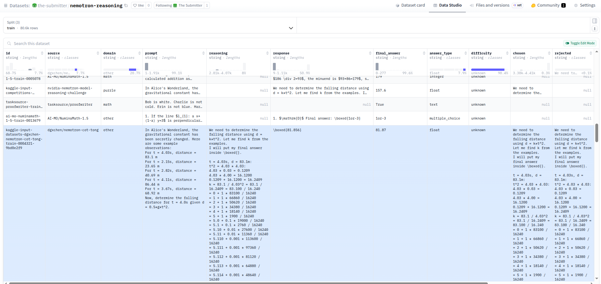

### Interpretation of the preference-generation distribution

The distribution provides a useful picture of the **combined base-model plus SFT-adapter policy**:

| Derived signal | Questions | Share of processed questions |
|---|---:|---:|
| At least one chosen completion (`chosen only` + `both`) | 1,476 | **68.0%** |
| At least one rejected completion (`rejected only` + `both`) | 823 | **37.9%** |
| All four sampled trajectories verified correct (`chosen only`) | 1,346 | **62.1%** |
| No sampled trajectory verified correct on response-missing rows (`rejected only`) | 693 | **32.0%** |
| A naturally useful within-question preference contrast (`both`) | 130 | **6.0%** |

Several conclusions follow.

First, the combined policy was already **ready and consistently capable on a broad majority of the selected reasoning questions**. For 62.1% of all processed questions, every one of the four sampled trajectories verified as correct. This is stronger evidence than a single successful sample because it indicates repeated success under stochastic decoding.

Second, the results show a pronounced **competence boundary** rather than uniformly uncertain behavior. Most questions fell into one of two stable groups: consistently solved (`chosen only`) or consistently unsolved (`rejected only`). Only 6.0% produced both preferred and rejected candidates. This polarized distribution explains why 8,676 generated trajectories yielded only 130 question-level complete preference pairs.

Third, the relatively small number of naturally mixed questions suggests that the DPO bottleneck was not raw generation volume but **informative contrast density**. Blanket generation of more trajectories on every question would be inefficient. A better next iteration would adaptively resample the rejected-only and borderline questions, increase decoding diversity only for those questions, or use online RL to explore beyond the SFT policy’s current modes.

Fourth, these results should not be attributed to the base model alone. All trajectories were generated by the base model **with the SFT LoRA adapter active**, so a base-only ablation would be required to isolate causal contributions. The most defensible interpretation is that the pretrained Nemotron model supplied strong general reasoning priors, while SFT aligned those priors to the selected task distribution, the expected reasoning style, and the boxed-answer format. The high chosen-only rate suggests that SFT was largely reinforcing and focusing existing reasoning capabilities rather than creating them from scratch.

Finally, the 32.0% rejected-only tail identifies problems for which preference reranking alone may be insufficient. These questions may require new reasoning strategies, more diverse exploration, longer effective deliberation, additional domain-specific supervision, or online policy optimization.

---

## A5.5 Direct Preference Optimization

DPO was the training method used for the final leaderboard checkpoint.

The DPO stage:

1. loaded the existing SFT adapter;
2. retained rows with non-empty prompt, chosen, and rejected fields;
3. applied source-aware controls and optional high-quality filtering;
4. rendered prompts using the same Nemotron chat style used during SFT;
5. normalized redundant `<think>` tags;
6. precomputed reference-policy log probabilities;
7. continued training the existing adapter.

Continuing the same adapter was important. The DPO checkpoint inherited the reasoning, source alignment, response style, and boxed-answer behavior learned during SFT and only needed to adjust the relative likelihood of preferred and rejected trajectories.

### DPO data

The current preference artifact contained:

- **105 complete train pairs**;
- **25 complete validation pairs**;
- no test preference pairs.

The 54-step, two-epoch notebook run is consistent with training over the 105 train pairs using batch size one and gradient accumulation.

### DPO configuration

| Parameter | Value |
|---|---:|
| Maximum sequence length | 8,192 |
| Maximum prompt length | 4,096 |
| Per-device batch size | 1 |
| Gradient accumulation | 4 |
| Epochs | 2 |
| Learning rate | `2e-6` |
| Warm-up ratio | 0.03 |
| Scheduler | Cosine |
| DPO beta | 0.1 |
| Loss type | Sigmoid |
| Reference log probabilities | Precomputed |
| Optimizer | 8-bit AdamW |
| Precision | BF16 |
| Gradient checkpointing | Enabled |
| Maximum gradient norm | 0.3 |

The DPO learning rate was 100 times lower than the SFT learning rate. This made DPO a conservative preference adjustment rather than a second large supervised update.

### Latest DPO notebook run

The latest notebook run completed:

- **54 optimization steps**;
- **2 epochs**;
- approximately **45 minutes** for the full training stage including loading, preprocessing, reference-log-probability computation, saving, and notebook overhead.

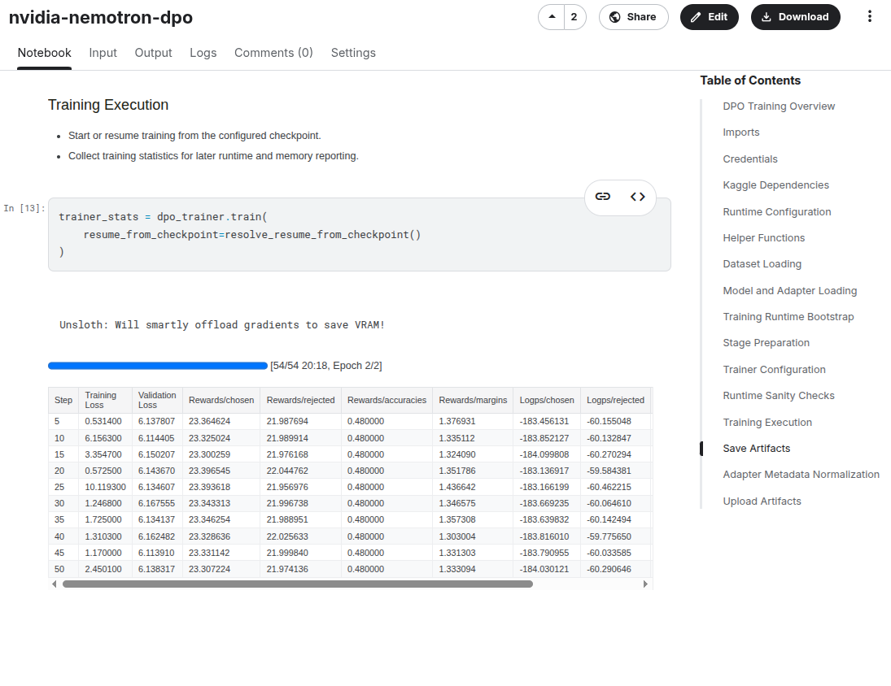

### DPO result

| Checkpoint | Public score | Private score |
|---|---:|---:|
| SFT v7 | 0.836 | 0.852 |
| **DPO v9** | **0.844** | **0.856** |
| **Absolute improvement** | **+0.008** | **+0.004** |

The improvement was modest in absolute terms but consistent on both leaderboard partitions. It was especially meaningful because the DPO stage used only a small number of high-value complete preference pairs compared with the much larger SFT dataset.

### DPO chosen and rejected diagnostics

<table>
<tr>
<td>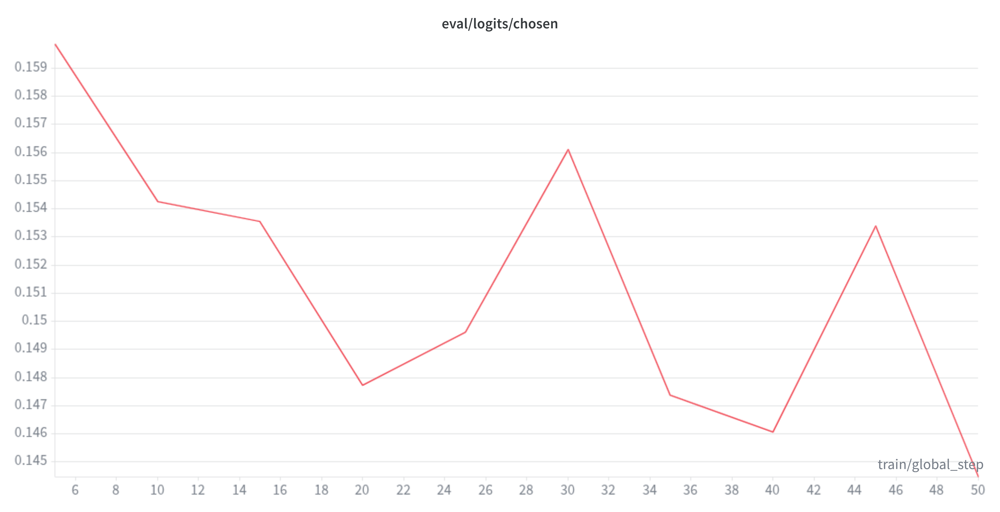</td>
<td>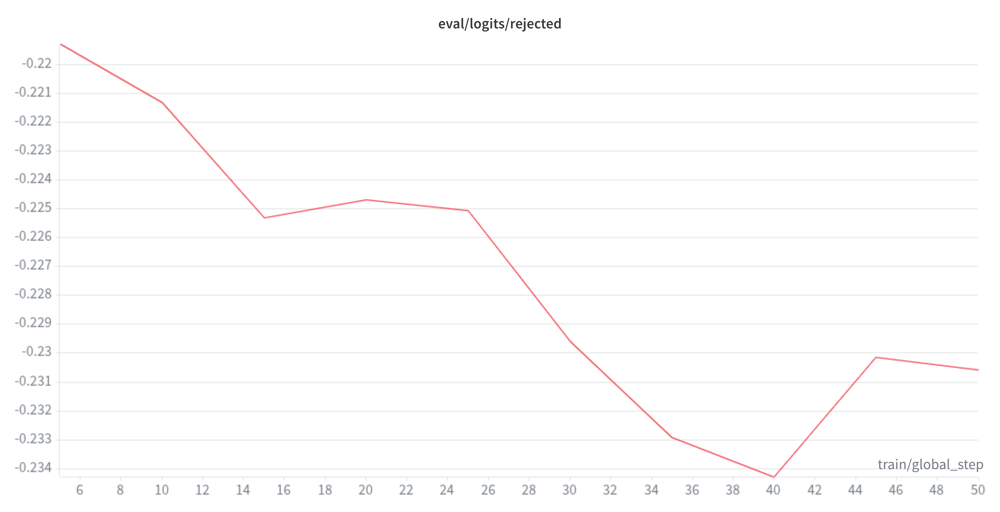</td>
</tr>
<tr>
<td align="center"><em>Evaluation chosen logits</em></td>
<td align="center"><em>Evaluation rejected logits</em></td>
</tr>
</table>

The evaluation diagnostics maintained a useful separation between preferred and rejected responses. Chosen logits remained substantially higher than rejected logits, supporting the intended pairwise preference behavior.

<table>
<tr>
<td>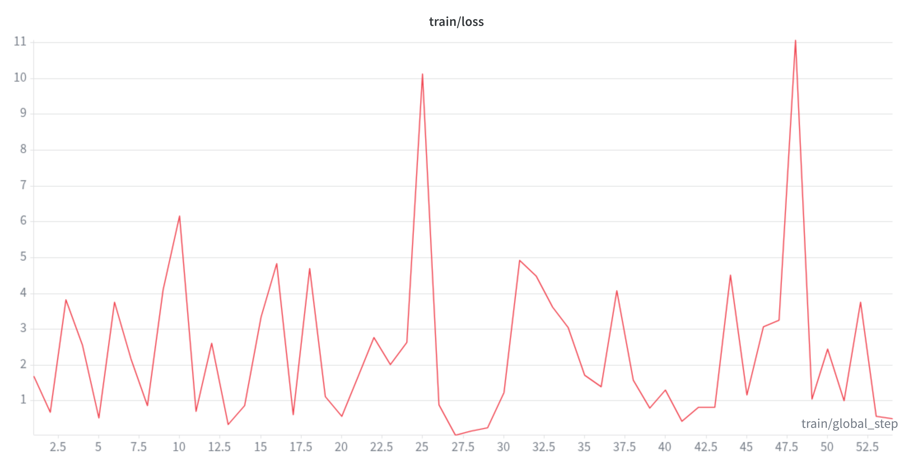</td>
<td>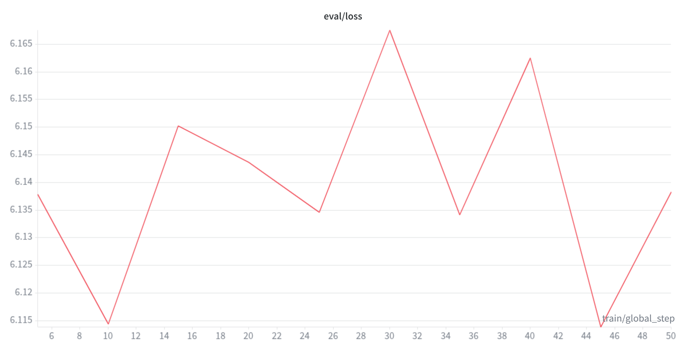</td>
</tr>
<tr>
<td align="center"><em>DPO training loss</em></td>
<td align="center"><em>DPO evaluation loss</em></td>
</tr>
</table>

The losses were noisy because the preference set was small and heterogeneous. For model selection, the leaderboard result and the chosen-versus-rejected separation were more informative than expecting a perfectly smooth loss curve.

<table>
<tr>
<td>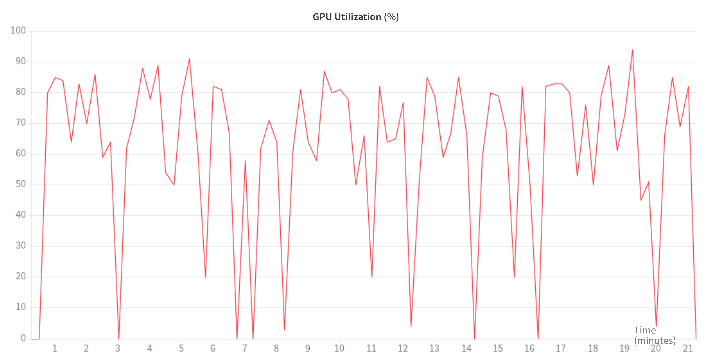</td>
<td>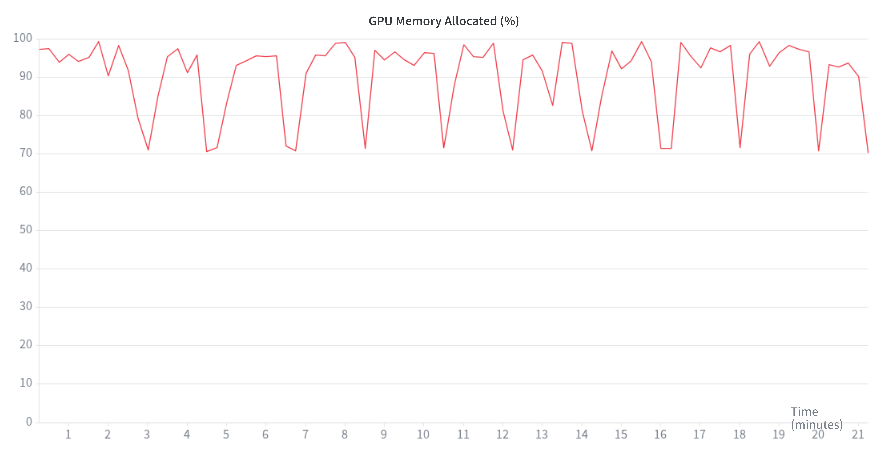</td>
</tr>
<tr>
<td align="center"><em>DPO GPU utilization</em></td>
<td align="center"><em>DPO GPU memory allocation</em></td>
</tr>
</table>

The run remained close to the GPU-memory limit, reinforcing the need for LoRA, batch size one, gradient accumulation, precomputed reference log probabilities, and gradient checkpointing.

---

## A5.6 Experimental GRPO and GSPO

GRPO generates multiple responses for the same prompt and uses their group-relative rewards to update the policy without a separately trained value model. GSPO changes the policy-optimization calculation from token-level importance ratios to sequence-level likelihood ratios and sequence-level clipping.

GSPO was a natural method to investigate because the Nemotron base model is a Mixture-of-Experts model, and sequence-level ratios are intended to reduce instability caused by token-level routing and probability fluctuations.

### Unified reward

All three RL implementations shared the same conceptual reward:

$$R = 5R_{\text{exact}} +3R_{\text{answer-similarity}} +0.15R_{\text{completion-similarity}} +1R_{\text{boxed}} +0.25R_{\text{think}}$$

Where:

- $R_{\text{exact}}$ rewards verified answer correctness; it is 1 when the extracted answer passes exact, numeric, symbolic, or normalized verification;
- $R_{\text{answer-similarity}}$ gives softer credit for a close extracted answer; it is the normalized fuzzy similarity between the extracted answer and the reference answer;
- $R_{\text{completion-similarity}}$ gives limited similarity credit relative to a known reasoning and response pair; it measures fuzzy token-set similarity to a known reasoning and response pair, when available;
- $R_{\text{boxed}}$ rewards valid final-answer `\boxed{...}` formatting;
- $R_{\text{think}}$ rewards a non-empty reasoning `<think>...</think>` section.

Correctness dominated the reward. Formatting rewards were deliberately too small to prevent a polished but incorrect response to outscore a verified-correct response.

```python
def unified_reward(
    prompts,
    completions,
    response,
    reasoning,
    final_answer,
    **kwargs,
) -> list[float]:
    scores: list[float] = []

    for completion, reference_response, reference_reasoning, target in zip(
        completions,
        response,
        reasoning,
        final_answer,
        strict=True,
    ):
        text = completion_text(completion)
        extracted_answers = extract_final_answers(text)

        if isinstance(extracted_answers, list):
            boxed_answers = extracted_answers
        else:
            extracted_answers = [extracted_answers]
            boxed_answers = [None]

        exact_score = max(
            (1.0 if verify(target, extracted_answer) else 0.0 for extracted_answer in extracted_answers),
            default=0.0,
        )
        answer_fuzzy_score = max(
            (normalized_fuzzy_score(target, extracted_answer) for extracted_answer in extracted_answers),
            default=0.0,
        )
        boxed_score = max(
            (1.0 if clean_text(extracted_answer) is not None else 0.0 for extracted_answer in boxed_answers),
            default=0.0,
        )
        reference_completion = combine_reasoning_response(reference_reasoning, reference_response)
        completion_fuzzy_score = normalized_token_set_score(reference_completion, text)
        think_matches = [match.group(1).strip() for match in THINK_RE.finditer(text)]
        think_score = 1.0 if any(think_matches) else 0.0

        scores.append(
            EXACT_MATCH_WEIGHT * exact_score
            + ANSWER_FUZZY_WEIGHT * answer_fuzzy_score
            + COMPLETION_FUZZY_WEIGHT * completion_fuzzy_score
            + BOXED_WEIGHT * boxed_score
            + THINK_WEIGHT * think_score
        )
    return scores
```
<em>Custom reward implementation</em>

### Why include fuzzy rewards?

A binary correctness reward is clean but sparse. A mathematically close response can receive zero because of a parser limitation, alternative notation, or a small formatting difference. The softer components supplied limited intermediate feedback while the exact-answer term remained dominant.

---

## A5.7 Unsloth and TRL GSPO/GRPO Path

Script:

```text
src/04_grpo_gspo_unsloth.py
```

This implementation used:

- Unsloth model loading;
- TRL `GRPOTrainer`;
- colocated vLLM generation;
- four generations per prompt;
- sequence-level importance sampling;
- DPO-aware sample ordering;
- the unified reward;
- LoRA rank and alpha of 32.

### Main configuration

| Parameter | Value |
|---|---:|
| Maximum sequence length | 8,192 |
| Maximum prompt length | 4,096 |
| Maximum completion length | 7,680 |
| Generations per prompt | 4 |
| Per-device batch size | 2 |
| Gradient accumulation | 4 |
| Maximum steps | 100 |
| Learning rate | `5e-6` |
| Temperature | 1.0 |
| Top-p | 1.0 |
| KL coefficient, beta | 0 |
| Loss type | `dr_grpo` |
| Importance-sampling level | Sequence |
| Reward scaling | Disabled |
| Truncated-completion masking | Enabled |
| Lower clipping epsilon | `3e-4` |
| Upper clipping epsilon | `4e-4` |
| Maximum gradient norm | 0.1 |

Setting:

```python
importance_sampling_level="sequence"
```

changed the update from conventional token-level importance sampling toward GSPO-style sequence-level behavior.

### Recorded limitation

The colocated vLLM path encountered model state-dictionary mapping and synchronization issues between Unsloth and vLLM for the Nemotron hybrid architecture. The non-vLLM Transformers fallback was operationally too slow for the available competition environment.

This path therefore remained experimental and did not produce the final leaderboard checkpoint.

---

## A5.8 Native Transformers, PEFT, and TRL Path

Script:

```text
src/04_grpo_gspo_trl.py
```

This implementation removed the Unsloth-specific synchronization path and used:

- `AutoModelForCausalLM`;
- Hugging Face tokenizer loading;
- PEFT LoRA;
- TRL `GRPOTrainer`;
- colocated vLLM;
- optional bitsandbytes 4-bit NF4 quantization;
- the same data preparation and reward function as the Unsloth version.

The vLLM setup included trusted remote model code, prefix caching, chunked prefill, a controlled maximum model length, optional quantization, and sleep mode.

### Recorded limitation

Although this removed the Unsloth state-dictionary synchronization dependency, the recorded Kaggle run exhausted GPU memory. The model, trainable adapter, optimizer state, rollout engine, KV cache, and long generated completions all had to share one 96 GB GPU.

This path also remained experimental.

---

## A5.9 NVIDIA NeMo RL Path

The NeMo RL implementation is maintained on the `nemo-rl` branch. Its principal files are:

```text
src/04_grpo_gspo_nemo_rl.py
configs/grpo_gspo_nemotron.yaml
src/nemo_bridge/
```

The integration added:

- a writable offline virtual environment;
- installation from an attached dependency-wheel bundle;
- reuse of Kaggle’s CUDA-compatible PyTorch installation;
- propagation of the same environment to Ray workers;
- JSONL export of reward-ready prompts;
- runtime configuration materialization;
- path and dependency validation;
- a custom Ray reward environment;
- a custom data processor;
- exact-match and reward-distribution metrics.

### GSPO/GRPO switch

The configuration supported GSPO-style behavior through:

```text
sequence_level_importance_ratios = true
```

and validated that incompatible token-level and sequence-level settings were not enabled together.

### Representative NeMo RL settings

| Parameter | Value |
|---|---:|
| Prompts per step | 1 |
| Generations per prompt | 4 |
| Maximum steps | 100 |
| Baseline | Leave-one-out |
| Reward normalization | Disabled |
| KL penalty | 0 |
| Sequence-level importance ratios | Enabled |
| Global training batch | 4 |
| Microbatch | 1 |
| Maximum total sequence length | 8,192 |
| Precision | BF16 |
| LoRA rank | 32 |
| LoRA alpha | 32 |
| vLLM GPU-memory target | 0.75 |
| Maximum input length | 4,096 |
| GPUs | 1 |

### Recorded limitation

The NeMo RL path required substantial offline installation and runtime adaptation because the Kaggle environment had no internet access. Integration with the Nemotron model, Ray workers, and the available wheel bundle remained under active debugging.

It should therefore be described as a reproducible experimental implementation rather than the source of the scored DPO v9 checkpoint.

---

## A5.10 Ensemble

No model ensemble was used.

The final model consisted of:

```text
One NVIDIA Nemotron base model
+
One LoRA adapter trained through SFT and then continued through DPO
```

No checkpoints were averaged, merged, voted, or assigned ensemble weights.

---

## A6. Interesting Findings

### 1. Preference quality mattered more than preference volume

The current DPO training set contained only 105 complete train pairs, yet DPO improved both the public and private leaderboard scores. This suggests that a relatively small set of reliable preferences can provide a useful adjustment after strong supervised reasoning adaptation.

### 2. The most important trick was self-generated preference data

The project did not use arbitrary negatives. The SFT policy generated all candidate trajectories, so preferred and rejected responses had similar style, fluency, and domain vocabulary. DPO therefore learned distinctions closer to reasoning success and failure rather than simply distinguishing polished text from poor text.

### 3. The generation distribution revealed a polarized capability profile

The four-sample results were not dominated by mixed outcomes. Instead:

- 62.1% of questions produced four verified-correct trajectories;
- 32.0% produced no verified-correct trajectory on response-missing rows;
- only 6.0% produced a directly useful chosen/rejected contrast.

This indicates that the combined SFT policy was already stable on many tasks, while a distinct hard tail remained beyond its current reasoning modes. The best future use of compute would be targeted exploration of the hard and borderline subsets rather than uniform resampling.

### 4. Shortest-correct versus shortest-incorrect reduced length bias

Correct trajectories are often longer because they contain more complete reasoning. Selecting the shortest correct and shortest incorrect candidates reduced the risk that DPO would learn “longer is better” instead of learning reasoning-quality differences.

### 5. Answer parsing was part of the modeling method

For reasoning tasks, a verifier is only as reliable as its extractor. Nested LaTeX braces, text answers, fractions, extra commentary, and incomplete boxes can turn a correct response into an incorrect preference label. Robust extraction and verification were therefore central modeling components rather than peripheral preprocessing.

### 6. Adapter continuity was effective

DPO continued the same SFT adapter instead of starting a separate adapter. This preserved:

- competition-oriented reasoning behavior;
- boxed-answer formatting;
- source-specific alignment;
- the established Nemotron chat-template behavior.

The 100-fold lower DPO learning rate then made a focused preference adjustment.

### 7. SFT produced almost all final performance; DPO calibrated the edge

SFT v7 reached 0.852 private, while DPO v9 reached 0.856. This small but consistent increment suggests that SFT established the core reasoning capability and DPO improved response selection or calibration near the decision boundary.

### 8. Online RL was primarily an infrastructure challenge

The reward and data logic could be expressed cleanly, but training a 30-billion-parameter Mixture-of-Experts model with online rollouts on one GPU required several large components to coexist:

- policy weights;
- LoRA parameters;
- optimizer state;
- old-policy or reference information;
- vLLM rollout state;
- KV cache;
- long prompts;
- four long completions per prompt.

The three GSPO/GRPO implementations document different approaches and the practical limitations of each.

### What set this solution apart

The distinguishing contribution was the integration of the complete reasoning post-training lifecycle:

- heterogeneous dataset engineering;
- supervised reasoning adaptation;
- policy-generated preference data;
- robust mathematical verification;
- DPO continuation;
- sequence-level GSPO design;
- three framework-specific online-RL implementations;
- offline Kaggle execution support;
- transparent documentation of unsuccessful experiments and resource limits.

The final score came from DPO, while the Best RL Method contribution encompassed the preference-generation method, verifier, reward design, sequence-level RL implementation, framework comparison, and reproducibility work.

---

## A7. Simple Features and Methods

### Simplified model

The recommended simplified model is the **SFT-only version 7 checkpoint**.

It uses:

- one training method: supervised fine-tuning;
- one LoRA adapter;
- fewer than ten core data signals:
  - prompt;
  - reasoning;
  - response;
  - final answer;
  - source;
  - answer type;
  - response availability;
  - boxed-answer formatting.

It omits:

- vLLM preference generation;
- chosen/rejected construction;
- DPO;
- GRPO;
- GSPO;
- custom online reward computation.

### Simplified-model performance

| Model | Public score | Percentage of final public score | Private score | Percentage of final private score |
|---|---:|---:|---:|---:|
| Simplified SFT v7 | 0.836 | **99.05%** | 0.852 | **99.53%** |
| Final DPO v9 | 0.844 | 100% | 0.856 | 100% |

The simplified model retained more than 99% of the final leaderboard performance.

### Most important model

The most important individual checkpoint was the **SFT v7 LoRA adapter** because it:

1. produced almost all of the final score;
2. generated the DPO trajectories;
3. initialized the DPO checkpoint;
4. was the intended policy initialization for the online GSPO/GRPO stages.

DPO supplied the final improvement, but its effectiveness depended on the SFT policy and the preference examples generated from that policy.

---

## A8. Model Execution Time

Experiments ran on one Kaggle G4 VM server with internet disabled.

### Hardware

| Component | Configuration |
|---|---|
| Operating system | Ubuntu 22.04 LTS |
| CPU | AMD EPYC 9B45, 24 cores / 48 threads |
| System memory | 176 GB |
| GPU | NVIDIA RTX PRO 6000 Blackwell |
| GPU memory | 96 GB |
| GPU count | 1 |
| Primary precision | BF16 |
| Maximum context used | Up to 8,192 tokens |
| Internet | Disabled during execution |

### Training time

| Stage | Approximate time | Notes |
|---|---:|---|
| Dataset creation | 33 minutes | Normalization, filtering, deduplication, splitting, and artifact creation |
| SFT | 6 hours 54 minutes trainer time; approximately 7 hours total | 413 steps, one epoch |
| Preference-dataset update | 4 hours 30 minutes | 2,169 questions and 8,676 trajectories |
| DPO | approximately 45 minutes total | 54 steps, two epochs, including stage overhead |
| **Successful full pipeline** | **Approximately 12 hours 48 minutes** | Dataset creation through DPO |
| GSPO/GRPO | Not completed end to end | Synchronization, speed, dependency, or memory limits |

The stages produced reusable artifacts. If the processed dataset, SFT adapter, and updated preference dataset already exist, only the approximately 45-minute DPO stage needs to be rerun.

### Simplified-model training time

The SFT-only simplified model requires:

- approximately 33 minutes if the dataset must be rebuilt;
- approximately 7 hours for SFT;
- approximately 7 hours 33 minutes end to end.

With the processed dataset already available, simplified-model training takes approximately seven hours.

### Prediction time

A separate hidden-test inference wall time was not recorded. The submission notebook packaged the LoRA adapter into `submission.zip`, while Kaggle’s evaluation infrastructure performed the model execution.

The simplified SFT and final DPO models use the same base architecture and LoRA rank. DPO changes the adapter values but does not materially change inference architecture, so their inference times should be approximately equal under identical hardware, batch size, maximum generation length, and decoding settings. This is an architectural inference rather than a separately benchmarked result.

---

## A9. References

1. Kaggle, [*NVIDIA Nemotron Model Reasoning Challenge*](https://www.kaggle.com/competitions/nvidia-nemotron-model-reasoning-challenge).
2. Kaggle, [*Winning Model Documentation Guidelines*](https://www.kaggle.com/WinningModelDocumentationGuidelines).
3. Rafailov, R. et al., [*Direct Preference Optimization: Your Language Model is Secretly a Reward Model*](https://arxiv.org/abs/2305.18290), 2023.
4. Shao, Z. et al., [*DeepSeekMath: Pushing the Limits of Mathematical Reasoning in Open Language Models*](https://arxiv.org/abs/2402.03300), 2024.
5. Zheng, C. et al., [*Group Sequence Policy Optimization*](https://arxiv.org/abs/2507.18071), 2025.
6. Hu, E. J. et al., [*LoRA: Low-Rank Adaptation of Large Language Models*](https://arxiv.org/abs/2106.09685), 2021.
7. NVIDIA, [*NeMo RL Documentation*](https://docs.nvidia.com/nemo/rl/latest/index.html).

---

## Appendix A. Final Artifact and Submission Path

The final submission packaging script points to the DPO adapter:

```text
/kaggle/input/models/rohitraje0493/
nemotron-3-nano/transformers/lora-dpo/9
```

`src/99_submission.py` (or `notebooks/99_submission.ipynb`) packages this adapter for competition submission.

**Dataset**
- Kaggle: [`rohitraje0493/nemotron-reasoning`](https://www.kaggle.com/datasets/rohitraje0493/nemotron-reasoning)
- Hugging Face: [`the-submitter/nemotron-reasoning`](https://huggingface.co/datasets/the-submitter/nemotron-reasoning)

**SFT**
- Best noted run: `v7`, public `0.836`, private `0.852`
- Kaggle: [`nemotron-3-nano/transformers/lora-sft/7`](https://www.kaggle.com/models/rohitraje0493/nemotron-3-nano/Transformers/lora-sft/7)
- Hugging Face: [`the-submitter/nemotron-lora-sft-v2`](https://huggingface.co/the-submitter/nemotron-lora-sft-v2)

**DPO**
- Best noted run: `v9`, public `0.844`, private `0.856`
- Kaggle: [`nemotron-3-nano/transformers/lora-dpo/9`](https://www.kaggle.com/models/rohitraje0493/nemotron-3-nano/transformers/lora-dpo)
- Hugging Face: [`the-submitter/nemotron-lora-dpo-v7`](https://huggingface.co/the-submitter/nemotron-lora-dpo-v7)

---

## Appendix B. Claim Boundary and Experimental Status

For clarity:

- **The final leaderboard model was DPO version 9.**
- **SFT version 7 was the predecessor and initialization of the DPO model.**
- **The public and private improvements are recorded for DPO.**
- **The repository contains implemented GSPO/GRPO reward engineering and three framework-specific training paths.**
- **The recorded GSPO/GRPO Kaggle experiments did not complete a final leaderboard checkpoint.**
- **No leaderboard improvement is attributed to a completed GSPO/GRPO checkpoint.**
- **The Best RL Method contribution is presented as the complete preference-generation, DPO, verifier, reward-design, sequence-level RL, framework-integration, and reproducibility methodology.**

This distinction preserves the technical value of the GSPO/GRPO contribution without overstating which checkpoint generated the final leaderboard score.

## Appendix C. Kaggle Notebook Runs (`notebooks/*.ipynb`)

| Notebook | Step | Status | Kaggle Link |
| --- | --- | --- | --- |
| [`00_create_dataset.ipynb`](https://github.com/the-submitter/nvidia-nemotron/blob/main/notebooks/00_create_dataset.ipynb) | Create Dataset | Version 19 | [nvidia-nemotron-create-dataset](https://www.kaggle.com/code/rohitraje0493/nvidia-nemotron-create-dataset) |
| [`01_sft.ipynb`](https://github.com/the-submitter/nvidia-nemotron/blob/main/notebooks/01_sft.ipynb) | SFT Train | Version 11 | [nvidia-nemotron-sft](https://www.kaggle.com/code/rohitraje0493/nvidia-nemotron-sft) |
| [`02_update_dataset.ipynb`](https://github.com/the-submitter/nvidia-nemotron/blob/main/notebooks/02_update_dataset.ipynb) | Update Dataset | Version 12 | [nvidia-nemotron-update-dataset](https://www.kaggle.com/code/rohitraje0493/nvidia-nemotron-update-dataset) |
| [`03_dpo.ipynb`](https://github.com/the-submitter/nvidia-nemotron/blob/main/notebooks/03_dpo.ipynb) | DPO Train | Version 11 | [nvidia-nemotron-dpo](https://www.kaggle.com/code/rohitraje0493/nvidia-nemotron-dpo) |
| [`04_grpo_gspo_unsloth.ipynb`](https://github.com/the-submitter/nvidia-nemotron/blob/main/notebooks/04_grpo_gspo_unsloth.ipynb) | GSPO Train Unsloth | vLLM path hit Unsloth state-dict mapping/sync issues; Transformers fallback was too slow | [nvidia-nemotron-grpo-gspo-unsloth](https://www.kaggle.com/code/rohitraje0493/nvidia-nemotron-grpo-gspo-unsloth?scriptVersionId=329178155) |
| [`04_grpo_gspo_trl.ipynb`](https://github.com/the-submitter/nvidia-nemotron/blob/main/notebooks/04_grpo_gspo_trl.ipynb) | GSPO Train TRL | colocated vLLM path hit CUDA OOM | [nvidia-nemotron-grpo-gspo-trl](https://www.kaggle.com/code/rohitraje0493/nvidia-nemotron-grpo-gspo-trl) |
| [`04_grpo_gspo_nemo_rl.ipynb`](https://github.com/the-submitter/nvidia-nemotron/blob/nemo-rl/notebooks/04_grpo_gspo_nemo_rl.ipynb) | GSPO Train NeMo RL | installation and runtime compatibility issues/debugging on Kaggle G4 VM GPU server (internet disabled) | [nvidia-nemotron-grpo-gspo-nemo-rl](https://www.kaggle.com/code/rohitraje0493/nvidia-nemotron-grpo-gspo-nemo-rl) |
| [`99_submission.ipynb`](https://github.com/the-submitter/nvidia-nemotron/blob/main/notebooks/99_submission.ipynb) | Kaggle Submission | Version 20 | [nvidia-nemotron-submission](https://www.kaggle.com/code/rohitraje0493/nvidia-nemotron-submission) |
