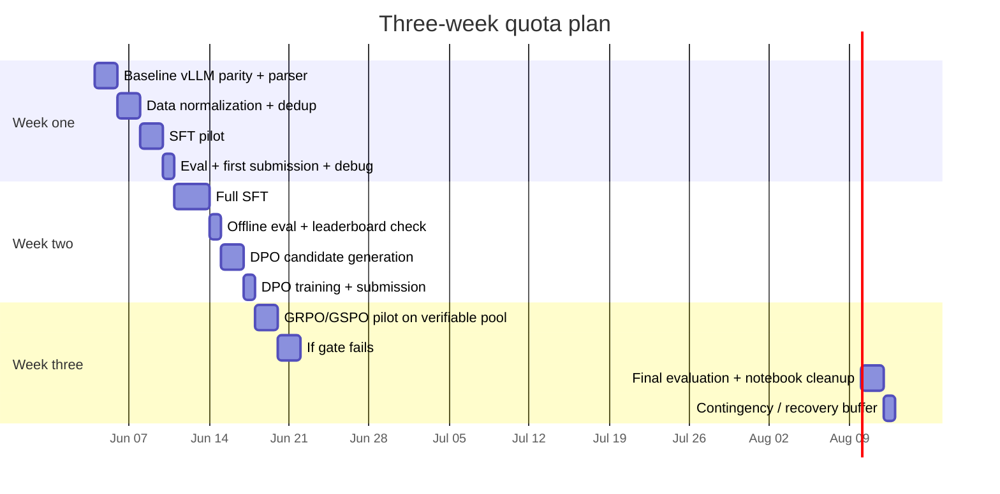

# Dataset Strategy for the NVIDIA Nemotron Reasoning Challenge

## Executive summary

The competition is evaluated on a hidden benchmark of textual logical-reasoning puzzles, and the public submission demo indicates greedy vLLM inference with `temperature=0.0`, `top_p=1.0`, `max_tokens=7680`, `max_model_len=8192`, `max_num_seqs=64`, `gpu_memory_utilization=0.85`, and a hard `max_lora_rank=32`. That combination strongly favors **high-quality, verifiable reasoning data**, **stable final-answer formatting**, and **adapter efficiency**, not sheer dataset size or stylistic chain-of-thought inflation. citeturn0search0turn1search0

For your remaining three weeks and roughly ninety GPU-hours total, the best use of time is **not** to train on every available reasoning set. The highest-probability path is a curated mix centered on: **NuminaMath-1.5**, **MATH**, **GSM8K**, **SVAMP**, **MAWPS/ASDiv**, **ProofWriter**, **FOLIO**, **PuzzTE**, **ProntoQA**, plus a modest **OpenR1-Math-220k** subset for verified multi-trace supervision. These datasets cover arithmetic, competition math, proof-like logical deduction, and puzzle-style reasoning while keeping answer verification tractable. citeturn11search0turn11search17turn7search1turn8search4turn45search2turn45search0turn12search0turn44search0turn34search2turn32search6turn33search0turn15search2turn43search0turn18search8turn18search5turn20search1turn21search0turn14search2turn35search1

The biggest practical mistake would be to over-index on long-context SFT because Kaggle’s metric uses `max_model_len=8192`. Since generation is also capped at `max_tokens=7680`, the real objective is not “train everything at 8k,” but “make the model reliably solve medium-length verifiable problems and emit clean final answers under greedy decoding.” A mixed-length curriculum is better: mostly 2k–4k training, with a small 6k–8k tail for robustness. citeturn1search0turn40search7turn40search8

You should also keep stage-specific adapters separate. In other words, maintain one LoRA for SFT, one for DPO, and one for RL-style exploration, and benchmark them independently. Merging LoRAs into the dense base after every phase makes rollback, ablation, and notebook reproducibility harder. Merge only at milestone boundaries if a downstream tool truly requires it.

## What the competition setup implies

Nemotron-3-Nano-30B-A3B is a hybrid MoE/Mamba-Transformer model with roughly **30B total parameters** and about **3.2B–3.5B active parameters per forward pass**, depending on which official NVIDIA description you reference. NVIDIA’s Hugging Face card describes a 30B-total / 3.5B-active hybrid MoE model, while NVIDIA Research describes the Nano family as roughly 31.6B total and 3.2B active, with long-context support and a Qwen3-derived post-training recipe. citeturn39search0turn39search2turn39search4

That architecture is why LoRA at rank 32 is plausible on your single ~96 GB GPU: you are not full-finetuning a dense 30B model, and Unsloth already advertises day-zero local fine-tuning support for Nemotron 3 Nano. Unsloth’s MoE notes also show that longer contexts are where memory pressure rises quickly, and their LoRA guidance emphasizes rank, alpha, batch, and QLoRA-vs-LoRA tradeoffs as the main levers. citeturn40search0turn40search7turn40search8

The submission metric is deterministic and greedy. That has three knock-on effects. First, training data should emphasize **answer faithfulness and exactness**, not merely “good sounding” reasoning. Second, DPO pairs should prefer **clear chosen/rejected separations** instead of subtle style preferences. Third, RL-style phases should stay on **verifiable subsets** where reward hacking is limited. This is exactly the pattern followed by recent open math-reasoning data efforts such as OpenR1, which explicitly combine rule-based verification with LLM-based judging rather than relying on judge-only labels. citeturn1search0turn36search2turn35search0turn35search1

The implication for dataset priority is straightforward:

- **Highest priority:** verifiable arithmetic, competition math, logic-deduction, and puzzle datasets with exact or canonicalized answers.
- **Medium priority:** broader multi-step reading/numerical reasoning sets where answers are still extractable or short.
- **Lower priority:** open-ended proof-only or style-heavy synthetic chain-of-thought corpora that are hard to score automatically.

## Recommended datasets

### Core datasets for SFT and DPO prompt sourcing

| Dataset | SFT priority | DPO prompt priority | Examples / size | Domains | Typical final answer | License | Quality notes | Source |
|---|---:|---:|---|---|---|---|---|---|
| **AI-MO/NuminaMath-1.5** | Very high | High | 896,215 rows; 531 MB | competition math, olympiad, proof, multi-step | boxed numeric, algebraic expression, occasional proof/text | Apache-2.0 | Best broad math backbone here: large, recent, open, competition-oriented, curated for post-training | citeturn11search0turn17search17 |
| **hendrycks/MATH** | Very high | High | ~12,500 problems; public snippet does not surface total size | olympiad / competition math | boxed numeric or symbolic answer | MIT | Classic hard-math set; good difficulty anchor, but dedup against MATH-500-style evals if you use them | citeturn7search1turn8search4turn36search3 |
| **open-r1/OpenR1-Math-220k** | High | Very high | 450,258 rows; 12.6 GB | verified math reasoning with multiple traces | numeric / symbolic | Apache-2.0 | Excellent DPO seed because each problem has multiple verified traces and at least one correct trace | citeturn35search1turn11search9 |
| **open-r1/OpenR1-Math-Raw** | Medium | High | 516,499 problems; 1,209,403 solutions; 8.03 GB | math reasoning, multi-trace self-consistency | numeric / symbolic | Apache-2.0 | Strong fallback if you want larger prompt pools, but noisier than the curated 220k set | citeturn35search0turn36search11 |
| **openai/gsm8k** | High | High | original dataset ~8.5k problems; HF page reports 17,584 rows across configs and 5.9 MB | grade-school arithmetic, multi-step word problems | single number | MIT reported on mirrors / derivatives | Essential for arithmetic format discipline and exact-answer scoring | citeturn45search2turn45search0turn45search9 |
| **ChilleD/SVAMP** | High | High | 1,000 rows; 509 kB | adversarial arithmetic word problems | single number | MIT | Small but disproportionately useful; specifically designed to stress shallow arithmetic heuristics | citeturn12search0turn44search0turn12search1 |
| **MU-NLPC/Calc-mawps** | Medium | Medium | 7,845 rows; 1.1 MB | arithmetic word problems | single number / simple expression | MIT | Light-weight arithmetic warm-up with calculation structure already exposed | citeturn34search2turn34search4 |
| **ASDiv** | Medium | Medium | 2,305 problems | elementary but linguistically diverse math word problems | number with optional unit | CC BY-NC 4.0 | Useful diversity boost; isolate if you want a permissive-only release later | citeturn32search6turn33search0 |
| **DROP** | Medium | Low to medium | 86,935 rows on HF; 11.5 MB; original benchmark 96k QAs | reading + discrete reasoning | number, span, date, short text | CC BY-SA 4.0 | Good for multi-step extraction/counting, but filter aggressively to short numeric / short-text answers | citeturn42search0turn42search1turn30search0turn30search1 |
| **ProofWriter** | High | High | 59,220 rows on HF clone | explicit logical deduction, proofs, abduction | True / False / Unknown; proof chain | CC BY on Kaggle mirror | Very strong for structured reasoning and rewardable logical steps | citeturn15search2turn43search0turn15search7 |
| **FOLIO** | High | Medium | 1,435 examples in paper; repo uses CC BY-SA 4.0 | expert-written first-order logical reasoning | True / False / Unknown | CC BY-SA 4.0 | Small but high-quality; better as val/gold plus modest SFT than as a bulk source | citeturn18search8turn18search5turn18search0 |
| **PuzzTE** | High | Medium | 23,855 rows; 11 MB | puzzle-based NLI, zebra / knights-and-knaves / comparison logic | entailment / contradiction / ambiguity | Apache-2.0 | Strongest clean, public text-puzzle corpus in this list for challenge alignment | citeturn20search1turn21search0turn20search2 |
| **ProntoQA** | Medium | Medium | 500-row public set; generator available | synthetic multi-hop first-order logic | True / False with reasoning chain | MIT / Apache-style repo artifacts | Tiny fixed set, but the generator is the real value: create controllable 3–5 hop logic training and RL prompts | citeturn14search2turn19search1turn19search2turn19search0 |

### Gold and watchlist datasets

| Dataset | Recommended role | Why | Caveat | Source |
|---|---|---|---|---|
| **ZebraLogicBench / WildEval ZebraLogic** | Gold / validation only | 4,259 logic-grid puzzles; directly relevant to puzzle-style deduction and complexity scaling | Treat as benchmark, not main training material; I did not verify a permissive training license from the public snippets reviewed | citeturn27search0turn25search2turn25search10 |
| **Enigmata** | GRPO watchlist if license clears | Puzzle-reasoning suite with 36 tasks across 7 categories, unlimited generators, and rule-based verifiers; conceptually ideal for RL on puzzle reasoning | Public repo and paper are easy to find, but I would manually verify license terms before using generated data in a public competition artifact | citeturn22search0turn22search2turn22search21 |
| **microsoft/orca-math-word-problems-200k** | Optional SFT backfill | 200k math word problems under MIT; easy way to add arithmetic scale | Synthetic answers from GPT-4-Turbo make it a lower-priority backfill, not a first-choice core set | citeturn32search0turn32search17 |

### Rationale and preprocessing guidance by dataset

The unifying target format I recommend is:

```text
<problem>
...
</problem>
<reasoning>
...
</reasoning>
<final>
\boxed{...}
</final>
```

This is not because boxed answers are magical, but because they make parsing, judging, DPO pairing, and RL reward assignment much simpler.

| Dataset | Why it belongs | Suggested preprocessing |
|---|---|---|
| NuminaMath-1.5 | Best single math backbone: recent, competition-oriented, large, open | Keep only English; drop extremely long proofs for initial SFT; extract final answer from `answer` if present, otherwise from last `\boxed{}` in solution; normalize LaTeX fractions, radicals, intervals, sets; keep a difficulty-balanced sample rather than the full corpus |
| MATH | Hard-math difficulty anchor | Convert “solution” to `<reasoning>` and canonical last boxed answer to `<final>`; dedup against MATH-500-style eval subsets; remove image-dependent or malformed entries |
| OpenR1-Math-220k | Best external source for preference-style reasoning because it already contains multiple verified traces | Use either one verified chosen trace for SFT or the problem-only field as a DPO prompt seed; do **not** blindly import all traces as chosen data; preserve correctness flags where available |
| GSM8K / SVAMP / MAWPS / ASDiv | Exact-answer arithmetic is perfect for answer parsing and RL reward coverage | Normalize to plain integers or rational strings; strip thousands separators; convert mixed numbers to canonical fractions; keep units out of the boxed answer unless the reference is unit-bearing |
| DROP | Adds multi-step extraction/counting/sorting behavior that math-only corpora miss | Filter to numeric, count, date, or short-span answers; discard narrative answers and long extractive spans; optionally synthesize short reasoning from annotation fields only if loss quality stays high |
| ProofWriter / FOLIO / ProntoQA / PuzzTE | Closest public sources to the competition’s hidden logical-puzzle behavior | Map labels to canonical tokens (`True`, `False`, `Unknown`, `entailment`, `contradiction`, `ambiguity`); for proof-like tasks, keep reasoning concise and compositional rather than verbose; for zebra/comparison puzzles, serialize the solution in sorted key order before boxing |

Across all datasets, apply the same normalization rules:

1. **Math answers.** Prefer `math-verify`-compatible canonical strings, not surface text. Fractions beat decimals when exactness matters. Strip whitespace, punctuation, and trailing periods; normalize signs and equivalent forms. citeturn36search0turn36search1  
2. **Boolean / NLI labels.** Map aliases to one canonical vocabulary only once, for example `yes/no`, `true/false/unknown`, or `entailment/contradiction/ambiguity`; do not mix formats across datasets.  
3. **Box extraction.** Last `\boxed{...}` wins. If absent, fall back to dataset-native markers like GSM8K’s `####`, `Answer:`, or a final-line numeric parse.  
4. **Dedup.** Use exact hash on normalized problem text first, then near-dedup on normalized alphanumeric text or MinHash/SimHash. Also decontaminate against your own held-out gold sets and any external benchmark you intend to report. OpenR1’s public decontamination script is a useful template. citeturn36search15

### Consolidated dataset composition

This mix is sized for your quota, your single-GPU setup, and the need to leave room for debugging and repeated public submissions.

| Source | Examples to use | Role | Expected normalized disk | Expected working RAM if fully materialized | Notes |
|---|---:|---|---:|---:|---|
| NuminaMath-1.5 | 70,000 | train | ~0.5–0.8 GB | ~1.5–2.5 GB | main math backbone |
| MATH | 10,000 | train | ~0.1–0.2 GB | ~0.3–0.6 GB | hard-math anchor |
| OpenR1-Math-220k | 20,000 | train / dpo_pool | ~0.6–1.0 GB | ~1.5–3.0 GB | verified multi-trace source |
| GSM8K | 7,000 | train | ~0.05–0.1 GB | ~0.1–0.2 GB | exact-answer arithmetic |
| SVAMP | 800 | train | tiny | tiny | hold out 200 |
| Calc-MAWPS | 6,000 | train | ~0.05–0.1 GB | ~0.1–0.2 GB | arithmetic diversity |
| ASDiv | 1,800 | train | tiny | tiny | hold out ~500 |
| DROP filtered numeric subset | 10,000 | train | ~0.2–0.4 GB | ~0.5–1.0 GB | only short, verifiable answers |
| ProofWriter | 20,000 | train / rl_pool | ~0.1–0.2 GB | ~0.3–0.6 GB | logic/proof training |
| PuzzTE | 12,000 | train / dpo_pool | ~0.1–0.2 GB | ~0.3–0.6 GB | puzzle-style logic |
| FOLIO | 1,000 | train / gold | tiny | tiny | keep ~300 for gold |
| ProntoQA generated | 8,000 | train / rl_pool | ~0.05–0.1 GB | ~0.1–0.2 GB | generate your own 3–5 hop cases |
| DPO prompt pool | 10,000–12,000 prompts | dpo | candidates usually ~4–8 GB | streamed | four candidates each via vLLM |
| Gold set | ~2,000 total | val / gold | tiny | tiny | from held-out SVAMP, FOLIO, ZebraLogicBench, ProofWriter, ProntoQA |

The resulting **SFT train mix is about 166k–168k examples**, which is large enough to move a LoRA adapter meaningfully but small enough to fit a one-epoch or lightly-over-one-epoch schedule in your time budget. The **DPO pool should be much smaller than the train mix**; quality matters far more than pair count. On your hardware, the real bottleneck is candidate generation plus auditing, not the JSONL size.

## Data pipeline and judging design

### Pipeline layout in py:percent-friendly form

The simplest maintainable structure is to keep all real logic in normal `.py` files and expose thin `py:percent` entrypoints for Kaggle notebooks. That gives you readable notebooks without turning notebook cells into your actual source of truth.

```python
# %% file: scripts/01_fetch_build.py
from src.sources import load_source
from src.normalize import to_unified_record
from src.dedup import exact_dedup, near_dedup
from src.mix import stratified_sample, write_parquet

SOURCE_IDS = [
    "numina15", "math", "gsm8k", "svamp", "mawps",
    "asdiv", "drop_num", "proofwriter", "folio",
    "puzzte", "prontoqa"
]

records = []
for sid in SOURCE_IDS:
    ds = load_source(sid, cache_dir="/tmp/hf")
    records.extend(to_unified_record(x, sid) for x in ds)

records = exact_dedup(records)
records = near_dedup(records)
records = stratified_sample(records)
write_parquet(records, "artifacts/sft_train.parquet")
```

```python
# %% file: src/answers.py
import re

BOX_RE = re.compile(r"\\boxed\s*{([^{}]+)}")
HASH_RE = re.compile(r"####\s*(.+)$", re.M)
ANS_RE  = re.compile(r"(?:^|\n)\s*(?:Final Answer|Answer)\s*:\s*(.+)$", re.I | re.M)

def extract_final_answer(text: str) -> str | None:
    boxes = BOX_RE.findall(text or "")
    if boxes:
        return boxes[-1].strip()
    for pat in (HASH_RE, ANS_RE):
        m = pat.search(text or "")
        if m:
            return m.group(1).strip()
    return None
```

```python
# %% file: src/normalize.py
from src.answers import extract_final_answer
from src.canonicalize import canonical_answer

def to_unified_record(row, source_id):
    problem = row["problem"].strip()
    reasoning = row.get("solution") or row.get("rationale") or row.get("proof") or ""
    gold = row.get("answer") or extract_final_answer(reasoning)
    return {
        "source": source_id,
        "problem": problem,
        "reasoning": reasoning.strip(),
        "final_answer": canonical_answer(gold, source_id),
        "text": (
            f"<problem>\n{problem}\n</problem>\n"
            f"<reasoning>\n{reasoning.strip()}\n</reasoning>\n"
            f"<final>\n\\boxed{{{canonical_answer(gold, source_id)}}}\n</final>"
        ),
    }
```

```python
# %% file: src/dedup.py
import hashlib

def norm_problem(s: str) -> str:
    return " ".join("".join(ch.lower() if ch.isalnum() else " " for ch in s).split())

def exact_dedup(records):
    seen, out = set(), []
    for r in records:
        key = hashlib.sha1(norm_problem(r["problem"]).encode()).hexdigest()
        if key not in seen:
            seen.add(key)
            out.append(r)
    return out

def near_dedup(records, threshold=0.92):
    # placeholder: use datasketch MinHashLSH or simhash in real code
    return records
```

```python
# %% file: scripts/03_generate_dpo_candidates.py
from vllm import LLM, SamplingParams

temps = [0.25, 0.55, 0.75, 0.90]
sp = [SamplingParams(temperature=t, top_p=0.95, max_tokens=2048) for t in temps]

def make_prompt(problem: str) -> str:
    return (
        "<problem>\n" + problem + "\n</problem>\n"
        "Reason carefully. End with <final>\\boxed{...}</final>."
    )
```

### Deterministic checking before model judging

Use deterministic scoring first, because most of the recommended datasets expose an answer format that is either exact or can be canonicalized. Math-Verify is specifically built for mathematical equivalence checking, and OpenR1 used a Math-Verify-plus-LLM stack to improve dataset quality. citeturn36search0turn36search2

Recommended scoring order:

1. **Exact canonical match** for normalized numeric, symbolic, boolean, and label answers.  
2. **Math equivalence** with `math-verify` or SymPy-based fallback for expressions, fractions, intervals, and sets. citeturn36search0turn36search1  
3. **Task-specific canonical match** for logic tables and zebra puzzles by serializing the final assignment in deterministic key order.  
4. **Format penalty** if the answer is missing, truncated, or unboxed.  
5. **Judge model only when necessary**, namely when multiple candidates are all non-exact but one may still be semantically closest.

For DPO pair construction, the safest rule is:

- **Keep only prompts with a clearly correct candidate** under deterministic scoring, unless you have a strong judge and audit budget.
- Among correct candidates, choose the **shortest fully correct** or **most concise valid** response.
- Among incorrect candidates, reject the one that is **validly wrong** rather than malformed, unless you explicitly want to train format discipline.
- If **all four candidates are wrong**, discard the prompt unless a judge can produce a high-confidence ranking and you manually spot-check a sample.

### Recommended judge models

| Judge / verifier | Best use | Why | Serving suggestion | Source |
|---|---|---|---|---|
| **math-verify** | first-pass math equivalence | purpose-built mathematical expression verifier; explicitly used in OpenR1 pipeline | CPU or lightweight Python call; no generation cost | citeturn36search0turn36search2 |
| **Qwen/Qwen2.5-Math-7B-Instruct** | fallback math judge | small enough to be practical on your GPU; math-specialized instruction model | BF16 if convenient; otherwise 4-bit AWQ/GPTQ/GGUF for cheap offline judging | citeturn37search2turn37search4turn37search9 |
| **Qwen/Qwen2.5-7B-Instruct** | logic / puzzle / NLI judge | robust general instruction model family with 7B option | BF16 or 4-bit; keep prompts short and require JSON output | citeturn37search12turn37search4 |
| **nvidia/Qwen-2.5-Nemotron-32B-Reward** | optional high-quality reward scorer | NVIDIA reward model; reported JudgeBench and RM-Bench performance including math | Use only if you can spare memory/time; likely quantize or isolate to dedicated scoring runs | citeturn38search5 |
| **nvidia/Qwen-3-Nemotron-32B-Reward** | optional newer reward scorer | current NVIDIA 32B reward-model line for response scoring | same caveat as above | citeturn38search7 |

For judge prompting, do **not** ask for long reasoning. Require terse structured output such as:

```json
{"winner": 2, "loser": 4, "confidence": 0.86, "reason": "candidate 2 reaches the correct label; candidate 4 contradicts clue 3"}
```

That is cheaper, easier to parse, and less prone to style bias than free-form judge chain-of-thought.

## Training and quota plan

### Recommended hyperparameters

The training recipe below is designed for your single ~96 GB VRAM setup, 48 vCPU, and limited quota. It assumes frozen-base LoRA or QLoRA, not full-finetuning.

| Phase | Data | Precision | LoRA | Max seq len | Micro-batch | Grad accum | LR | Epochs / steps | Notes |
|---|---|---|---|---:|---:|---:|---:|---|---|
| **SFT pilot** | 20k–30k mixed examples | QLoRA 4-bit preferred; BF16 LoRA if stable | r=32, alpha=64, dropout=0.05 | 3072 | 2 | 8–16 | 8e-5 (QLoRA) or 5e-5 (BF16 LoRA) | ~0.5 epoch | sanity-check formatting and memory |
| **SFT full** | ~166k main mix | same | same | 3072 for most, 4096 tail, tiny 6144–8192 tail | 1–2 | 16–32 | 5e-5 to 8e-5 | 1.0–1.25 epoch | pack short examples only |
| **DPO** | 10k–12k prompts, clear pairs only | same | continue from SFT adapter | prompt 3072 / total 4096 | 1 | 16 | 2e-5 to 3e-5 | 1 pass over pairs | beta 0.1–0.2 |
| **GRPO / GSPO pilot** | 2k–5k fully verifiable prompts | same | initialize from best SFT or DPO LoRA | 2048 prompt / 1024–2048 output | 1 | depends on framework | 5e-6 to 1e-5 | short pilot only | use only if reward coverage is strong |

Additional settings that are worth keeping fixed:

- `bf16=True`
- gradient checkpointing on
- FlashAttention / fused kernels if your stack supports them
- warmup ratio around **3%**
- cosine or constant-with-warmup scheduler
- `max_grad_norm=0.3`
- `weight_decay=0.0` to `0.01`
- target only attention and MLP linear layers first; do **not** start by adapting routers or lm_head on this timeline

Because the challenge caps `max_lora_rank` at 32, I would not attempt clever adapter proliferation. Put your effort into **data quality, pair quality, and prompt formatting** instead. citeturn1search0turn40search8

### Inference settings

#### Kaggle-parity evaluation

Use the competition’s published parameters for any offline score you want to compare to leaderboard behavior:

| Setting | Value |
|---|---:|
| `temperature` | 0.0 |
| `top_p` | 1.0 |
| `max_tokens` | 7680 |
| `max_model_len` | 8192 |
| `max_num_seqs` | 64 |
| `gpu_memory_utilization` | 0.85 |
| `max_lora_rank` | 32 |

These come from the public submission demo/notebook material. citeturn1search0

For local Nemotron serving, NVIDIA’s public usage notes show a custom reasoning parser for vLLM; using the official parser is the closest reproduction of expected reasoning behavior when you benchmark locally. citeturn40search1

#### DPO candidate generation

For DPO, do **not** mirror Kaggle’s greedy inference. You need diversity.

Recommended candidate settings:

| Setting | Suggested value |
|---|---:|
| candidates per prompt | 4 |
| temperatures | 0.25 / 0.55 / 0.75 / 0.90 |
| `top_p` | 0.95 |
| `max_tokens` | 1024–2048 for arithmetic/logic, 2048–3072 for hard math |
| judge output length | 32–128 |
| generation prompt | always require `\boxed{...}` final answer |

### GPU-hour allocation

A realistic plan that still leaves contingency time is:

| Week | Phase | GPU-hours |
|---|---|---:|
| Week one | env setup, vLLM parity harness, data build, SFT pilot, one early submission | 30 |
| Week two | full SFT, eval, DPO candidate generation, DPO training, submission | 30 |
| Week three | GRPO/GSPO pilot **only if gates pass**, otherwise second DPO/SFT ablation, final submissions, writeup notebook stabilization | 30 |

A more concrete breakdown:



With only ~20 GB persistent disk plus larger `/tmp`, keep all transient HF caches, candidate generations, and merged artifacts under `/tmp`, and copy back only final Parquet mixes, LoRA checkpoints, and notebook-ready outputs.

## Risks and decision gates

The largest risks are not model failure in the abstract. They are **data noise**, **license drift**, **reward leakage**, and **wasted quota on RL before SFT is stable**.

The most important decision gates are:

| Gate | Proceed only if | If not |
|---|---|---|
| **After SFT pilot** | final-answer formatting is stable; no truncation regressions; held-out exact match clearly exceeds base on your internal mix | fix formatting and data mix before longer training |
| **After full SFT** | public LB or offline gold bundle improves materially over base; error profile suggests ranking/reward can help | stop and retune SFT mix rather than forcing DPO |
| **After DPO data audit** | at least a strong majority of retained pairs have deterministic chosen/rejected separation and low judge ambiguity | shrink prompts, reduce domains, or discard noisy pair builders |
| **Before GRPO/GSPO** | reward coverage is high on the RL subset and responses remain boxed / parseable | skip RL and spend remaining time on SFT/DPO ablations |

My practical threshold would be:

- **DPO is worth it** only if SFT already improves leaderboard behavior and your DPO pool has clear, mostly deterministic pairs.
- **GRPO/GSPO is worth it** only if you can keep RL to verifiable domains: arithmetic, objective competition math, ProofWriter-style truth classification, ProntoQA-style logic, and puzzle labels with deterministic solvers.
- If your Week-two DPO result does **not** beat the best SFT adapter, do **not** burn the final week on speculative RL. Use that week for data-mix refinement and cleaner DPO prompts.

### License and release caution

Several useful datasets here are permissive, including NuminaMath-1.5, OpenR1-Math-220k, SVAMP, MATH, PuzzTE, and Calc-MAWPS. Others carry **share-alike** or **non-commercial** terms, notably FOLIO, DROP, and ASDiv. If you plan to publish the LoRA adapter and notebook broadly, keep a manifest of exact sources used and consider maintaining a second **permissive-only** training variant for safer downstream reuse. citeturn11search17turn35search1turn44search0turn8search4turn21search0turn34search2turn18search5turn42search1turn33search0

### Open questions and limitations

Two items remain worth treating cautiously.

First, **Enigmata** looks extremely relevant for RL on puzzle reasoning because it explicitly offers generator-verifier tasks across puzzle categories, but I would manually confirm repository/data licensing before using generated derivatives in a public competition artifact. citeturn22search0turn22search2

Second, **ZebraLogicBench** is excellent as a gold set for puzzle-style validation, but I would not make it a core training source on this timeline. It is more valuable as an alignment check for puzzle reasoning than as bulk finetuning data, and the public snippets I reviewed did not give me enough confidence to label it a clean permissive training dataset. citeturn27search0turn25search2turn25search10

The bottom line is simple: with your quota and hardware, the strongest strategy is **curated SFT → careful DPO → small RL pilot only if the rewardable subset is clean**. The dataset mix should be anchored by **NuminaMath-1.5 + MATH + GSM8K/SVAMP + ProofWriter/FOLIO/PuzzTE + a modest OpenR1 slice**, not by giant generic instruction corpora. That is the highest-confidence route to a competitive rank-32 Nemotron LoRA under the Kaggle metric. citeturn11search0turn7search1turn45search2turn12search1turn15search7turn18search8turn20search2turn35search1turn1search0